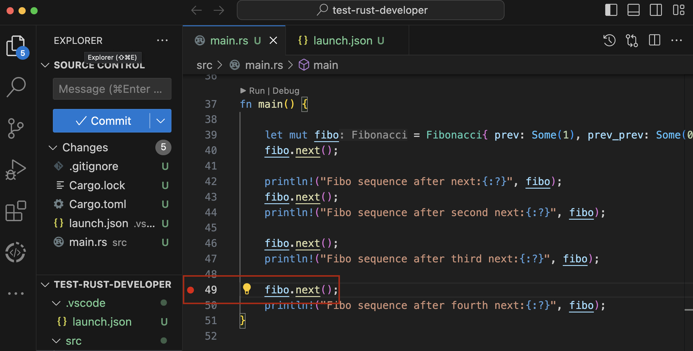
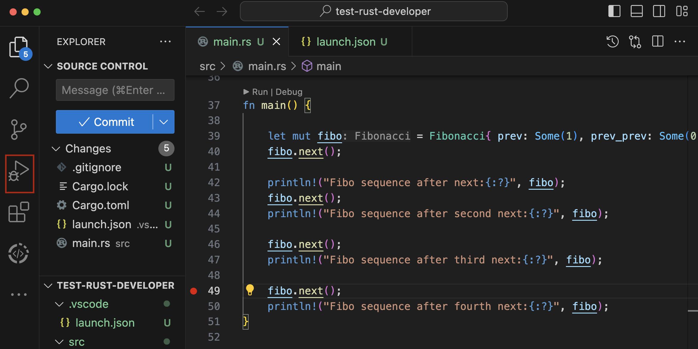
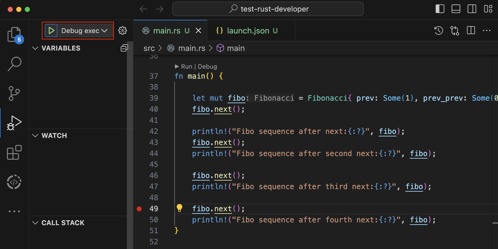
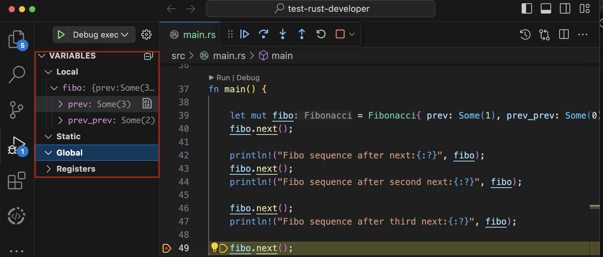
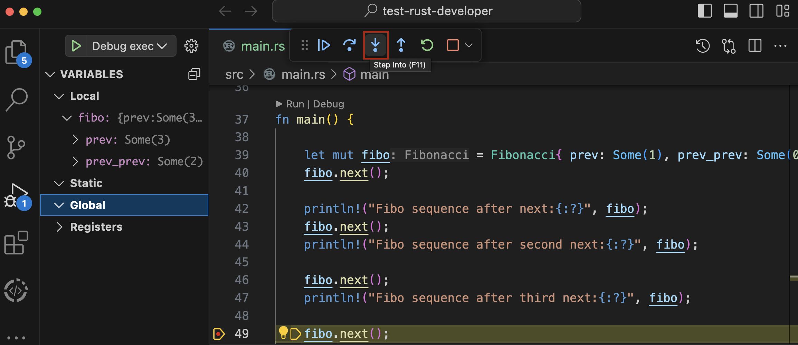
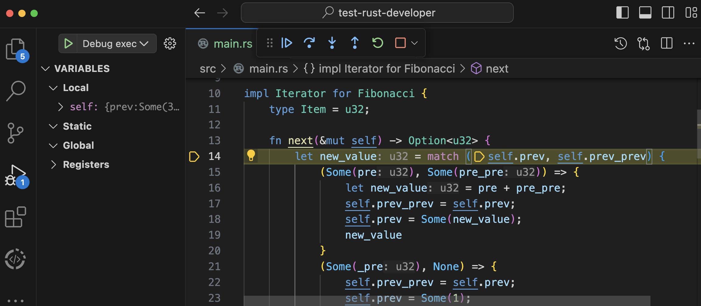

## Cách debug trong Rust 

Trong quá trình code một chương trình ứng dụng, ta có thể gặp phải bug( lỗi) . Điều này dẫn đến toàn bộ ứng dụng có thể lỗi. Vậy chúng ta cần biết cách debug sao cho fix được lỗi mà ta đang gặp phải 


### Cách đơn giản nhất là kiểm tra terminal , sử dụng macro println!, panic!

#### Kiểm tra terminal 

Ta có 1 ví dụ lỗi cơ bản sau:
```rust
fn main() {
    let items = vec![10, 20, 30, 40, 50];
    let mut result = 0; 

    for i in 0..=items.len() {
        result += items[i];

    }
    println!("Result : {}", result);
}
```

Khi chạy chương trình , bug xảy ra 

```thread 'main' panicked at src/main.rs:5:41:
index out of bounds: the len is 5 but the index is 5
note: run with `RUST_BACKTRACE=1` environment variable to display a backtrace
```

Dựa vào thông tin lỗi được in ra từ terminal, có thể phán đoán được lỗi sai ở đâu 

#### Sử dụng println!

- Giả sử không phán đoán được lỗi ở đâu, có thể sử dụng println! để in ra kết quả . nếu như không xảy ra lỗi thì vẫn in ra bình thường

Ví dụ:
In ra `i` và `items[i]` để kiểm tra 

```rust
fn main() {
    let items = vec![10, 20, 30, 40, 50];
    let mut result = 0; 

    for i in 0..=items.len() {
        println!("Item {}: {}", i, items[i]);
        result += items[i];

    }
    println!("Result : {}", result);
}
```

- Kết quả sau khi chạy chương trình:

```Item 0: 10
Item 1: 20
Item 2: 30
Item 3: 40
Item 4: 50
thread 'main' panicked at src/main.rs:6:41:
index out of bounds: the len is 5 but the index is 5
note: run with `RUST_BACKTRACE=1` environment variable to display a backtrace
```

**Từ kết quả trên, ta phán đoán được vòng lặp bị sai , lặp quá giới hạn `len` của `vector`**

- Fix

```rust
fn main() {
    let items = vec![10, 20, 30, 40, 50];
    let mut result = 0; 

    for i in 0..items.len() {
        println!("Item {}: {}", i, items[i]);
        result += items[i];

    }
    println!("Result : {}", result);
}
```

- Kết quả hiện ta từ terminal

```Item 0: 10
Item 1: 20
Item 2: 30
Item 3: 40
Item 4: 50
Result : 150
```


### Sử dụng debug tool trên VSCode 
Khi chương trình quá lớn, khả năng manually debug bằng cách println! hoặc panic! khó khả thi. Chúng ta có thể dùng công cụ debug tool trên VSCode

Yêu cầu: Đã cài đặt `rust-analyzer` 

- Cài thêm debugging support trên extension 
+ Window: https://marketplace.visualstudio.com/items?itemName=ms-vscode.cpptools
+ MacOs, Linux: https://marketplace.visualstudio.com/items?itemName=vadimcn.vscode-lldb

Ví dụ: Ta sử dụng Iterator để tạo ra dãy Fibonaci như sau

```rust
#[derive(Default, Debug)]
pub struct Fibonacci {
	/// The most recent value this iterator has yielded
	prev: Option<u32>,
	/// The second most recent value that this iterator has yielded
	prev_prev: Option<u32>,
}

impl Iterator for Fibonacci {
	type Item = u32;

	fn next(&mut self) -> Option<u32> {
		let new_value = match (self.prev, self.prev_prev) {
			(Some(pre), Some(pre_pre)) => {
				let new_value = pre + pre_pre;
				self.prev_prev = self.prev;
				self.prev = Some(new_value);
				new_value
			}
			(Some(_pre), None) => {
				self.prev_prev = self.prev;
				self.prev = Some(1);
				1
			}
			(None, None) => {
				self.prev = Some(0);
				0
			}
			(_, _) => return None,
		};

		Some(new_value)
	}
}

fn main() {

    let mut fibo = Fibonacci{ prev: Some(1), prev_prev: Some(0)};
    fibo.next();

    println!("Fibo sequence after next:{:?}", fibo);
    fibo.next();
    println!("Fibo sequence after second next:{:?}", fibo);

    fibo.next();
    println!("Fibo sequence after third next:{:?}", fibo);

    fibo.next();
    println!("Fibo sequence after fourth next:{:?}", fibo);
}
```

Có thể sử dụng debug tool để debug kết quả trong quá trình next():
+ Đánh dấu Checkpoint bằng cách click dòng code bạn muốn debug (nơi bạn mong muốn debug -> hiển thị kết quả)


+ Click vào nút `Run and Debug` (hình con bọ trên VSCode) 


+ Click `Debug Exec ở góc bên trái màn hình` để tiến hành debug 


+ Xuất hiện giá trị biến local, static, global


+ Nhấn nút `Step into` để vào trong hàm `next`


+ Tiếp tục `Step into` để chạy từng code trong hàm `next`


### Cách sử dụng Error Handling 
Cách này chúng ta chủ động định nghĩa lỗi cho chương trình, hạn chế quá trình bug xảy ra 
Các bạn có thể tham khảo ở đây:
https://github.com/CocDap/Rust-Bootcamp-2024/tree/main/08-Rust-Error-Handling


### Cách sử dụng crate log

Log hiểu đơn giản là in ra thông tin kết quả của 1 dòng lệnh nào đó. Log dùng để debug, monitor của 1 ứng dụng nhằm cho việc phát hiện lỗi trở nên dễ dàng hơn. Nó cơ bản là println!, nhưng sẽ gồm nhiều chức năng hơn:
+ Level-based : WARN, INFO, DEBUG, ERROR. Những level này nhằm thông báo rằng dòng lệnh in ra với mục đích gì 
+ Custom log: đẹp hơn, dễ quan sát hơn 

Ví dụ: 

1. Install `log` và `env_logger`

```bash
cargo add log env_logger
```

2. Đặt dòng lệnh `log` bạn muốn log giá trị ra 
Ví dụ:

```rust
impl Iterator for Fibonacci {
	type Item = u32;

	fn next(&mut self) -> Option<u32> {
		let new_value = match (self.prev, self.prev_prev) {
			(Some(pre), Some(pre_pre)) => {
				let new_value = pre + pre_pre;
				self.prev_prev = self.prev;
				self.prev = Some(new_value);
				new_value
			}
			(Some(_pre), None) => {
				self.prev_prev = self.prev;
				self.prev = Some(1);
				1
			}
			(None, None) => {
				self.prev = Some(0);
				0
			}
			(_, _) => return None,
		};
		log::debug!(target:"Fibonacci", "New Value:{}", new_value);
		Some(new_value)
	}
}
``` 

Đối với ví dụ này, dùng debug để in ra giá trị `new_value` sau khi thực hiện `next`. Thêm phần `target` để hiểu diễn giải thông tin này của của hàm `fibonacci`


3. Custom log - Thêm thời gian cho log

+ Lưu ý cài đặt `chrono` crate để lấy thời gian 
+ Import thư viện 
```rust
// custom log
use env_logger::{Builder, Env};
// write thông tin thêm vào log 
use std::io::Write;
```

+ Code chính 
```rust
fn main() {
	let mut builder = Builder::from_env(Env::default());
	builder.format(|buf, record| {
		writeln!(buf, "{} [{}] -{}", chrono::Local::now().format("%d-%m-%Y %H:%M:%S"), record.level(),record.args())
	});
	builder.init();
    let mut fibo = Fibonacci{ prev: Some(1), prev_prev: Some(0)};
    fibo.next();
    fibo.next();
    fibo.next();
    fibo.next();

}

```
+ Chạy chương trình 

```bash
RUST_LOG=debug cargo run
```

+ Kết qủa 
```
   Compiling test-rust-developer v0.1.0 (/Users/xxx/test/test-rust-developer)
    Finished dev [unoptimized + debuginfo] target(s) in 0.48s
     Running `target/debug/test-rust-developer`
[2024-05-04T04:01:28Z DEBUG Fibonacci] New Value:1
[2024-05-04T04:01:28Z DEBUG Fibonacci] New Value:2
[2024-05-04T04:01:28Z DEBUG Fibonacci] New Value:3
[2024-05-04T04:01:28Z DEBUG Fibonacci] New Value:5
```

4. Xuất thông tin ra file .log 
+ Import thư viện 

```rust
use std::fs::File;
```

+ Tạo file log, nhúng file log vào `builder`

```rust
fn main() {
    let log_file = File::create("fibonacci.log").unwrap();

    let mut builder = Builder::from_env(Env::default());
    builder.format(|buf, record| {
        writeln!(
            buf,
            "{} [{}] -{}",
            chrono::Local::now().format("%d-%m-%Y %H:%M:%S"),
            record.level(),
            record.args()
        )
    });
    // nhúng file log 
    builder
        .target(env_logger::Target::Pipe(Box::new(log_file)))
        .init();
	
    let mut fibo = Fibonacci {
        prev: Some(1),
        prev_prev: Some(0),
    };
    fibo.next();
    fibo.next();
    fibo.next();
    fibo.next();
}
```


