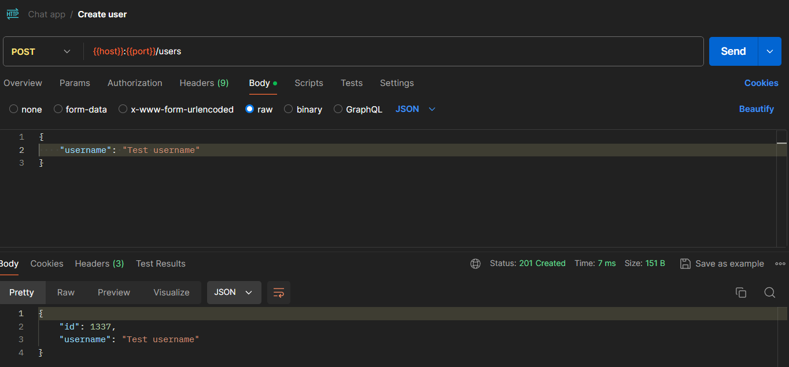
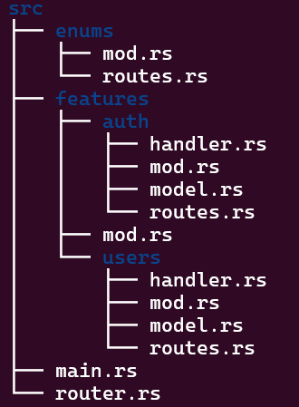

# Xây dựng real time chat app (P1)

Chào mọi người, hiện tại mình đang bắt đầu học về ngôn ngữ lập trình Rust. Sau khi học các kiến thức cơ bản để áp dụng kiến thức đã học thì hôm nay mình sẽ cùng mọi người xây dựng real time chat app bằng Rust nhé.

# Kiến thức yêu cầu

- Biết cơ bản về ngôn ngữ Rust
- Biết về cơ chế hoạt động của server (HTTP, request, response,…)

# Kết quả đạt được sau bài viết này

- Setup codebase
- Hiểu cơ bản về async await
- Áp dụng được các kiến thức cơ bản của Rust
- Xây dựng API cơ bản
- Basic authentication với JWT

# Hướng dẫn

## Tạo Web Service

Đầu tiên ta sẽ tạo 1 project mới

```rust
	cargo new chat-app
	cd chat-app
```

Trong phần này mình sẽ sử dụng framework [axum - Rust (docs.rs)](https://docs.rs/axum/latest/axum/#high-level-features). Đây là framework phát triển web được sử dụng khá phổ biến trong Rust.

Mình sẽ thêm vào Cargo.toml các crate cần thiết cho project

```toml
[dependencies]
axum = "0.7.5"
serde = { version = "1.0.198", features = ["derive"]}
serde_json = "1.0.116"
tokio = { version = "1.37.0", features = ["full"] }
tracing = "0.1.40"
tracing-subscriber = { version = "0.3.18", features = ["env-filter"]}
```

Bên docs họ có cung cấp 1 đoạn code example để setup web server

```rust
use axum::{
    routing::{get, post},
    http::StatusCode,
    Json, Router,
};
use serde::{Deserialize, Serialize};

#[tokio::main]
async fn main() {
    // initialize tracing
    tracing_subscriber::fmt::init();

    // build our application with a route
    let app = Router::new()
        // `GET /` goes to `root`
        .route("/", get(root))
        // `POST /users` goes to `create_user`
        .route("/users", post(create_user));

    // run our app with hyper, listening globally on port 3000
    let listener = tokio::net::TcpListener::bind("0.0.0.0:3000").await.unwrap();
    axum::serve(listener, app).await.unwrap();
}

// basic handler that responds with a static string
async fn root() -> &'static str {
    "Hello, World!"
}

async fn create_user(
    // this argument tells axum to parse the request body
    // as JSON into a `CreateUser` type
    Json(payload): Json<CreateUser>,
) -> (StatusCode, Json<User>) {
    // insert your application logic here
    let user = User {
        id: 1337,
        username: payload.username,
    };

    // this will be converted into a JSON response
    // with a status code of `201 Created`
    (StatusCode::CREATED, Json(user))
}

// the input to our `create_user` handler
#[derive(Deserialize)]
struct CreateUser {
    username: String,
}

// the output to our `create_user` handler
#[derive(Serialize)]
struct User {
    id: u64,
    username: String,
}
```

Ta copy đoạn code trên vào file [`main.rs`](http://main.rs) sau đó run dự án để test thử xem chạy được không

Mọi người tải [cargo-watch - crates.io: Rust Package Registry](https://crates.io/crates/cargo-watch) (giống như nodemon) hiểu đơn giản là khi bất kì sự thay đổi nào với mã nguồn thì nó sẽ build và run lại file binary

```powershell
cargo watch -q -c -w src/ -x run
```

Ta dùng Postman để kiểm tra xem server hoạt động chưa nhé



## Tìm hiểu các thành phần bên trong

Tiếp đến ta đi vào chi tiết source code để hiểu rõ hơn về các thành phần bên trong 

```rust
#[tokio::main]
async fn main() {
    // initialize tracing
    tracing_subscriber::fmt::init();

    // build our application with a route
    let app = Router::new()
        // `GET /` goes to `root`
        .route("/", get(root))
        // `POST /users` goes to `create_user`
        .route("/users", post(create_user));

    // run our app with hyper, listening globally on port 3000
    let listener = tokio::net::TcpListener::bind("0.0.0.0:3000").await.unwrap();
    axum::serve(listener, app).await.unwrap();
}
```

- async / await: Khi ta chạy chương trình, lúc này chỉ có main thread được chạy và những task nào cần tốn nhiều thời gian để xử lý (await) sẽ được xử lý ở background trong khi đó main thread sẽ tiến hành xử lý những task khác, sau khi task kia xử lý xong ở background thì main thread sẽ quay lại task đó và tiến hành xử lý tiếp.
    - Ví dụ: khi client request đến server một resource nào đó mà server cần đọc từ file mà quá trình đọc từ file có thể sẽ rất lâu nếu mà ta chạy đồng bộ thì phải đợi main thread xử lý xong việc đọc file rồi mới xử lý được các task khác. Lúc này khi 1 client khác request đến thì sẽ phải đợi main thread xử lý xong việc đọc file rồi mới đến lượt mình
    - Một vài điều cần lưu ý khi làm việc với async / await
        - await chỉ được gọi trong async function
- #[tokio::main]: attribute → chạy hàm main trong context bất đồng bộ
- tracing: setup log system để tiện debug, monitor,…
- Router: định nghĩa các path để truy cập các resource
    - HTTP method: GET, POST, PUT, DELETE
- listener: set ip address và port cho web server
- serve: chạy server trên listener đã tạo ở trên

```rust
// basic handler that responds with a static string
async fn root() -> &'static str {
    "Hello, World!"
}

async fn create_user(
    // this argument tells axum to parse the request body
    // as JSON into a `CreateUser` type
    Json(payload): Json<CreateUser>,
) -> (StatusCode, Json<User>) {
    // insert your application logic here
    let user = User {
        id: 1337,
        username: payload.username,
    };

    // this will be converted into a JSON response
    // with a status code of `201 Created`
    (StatusCode::CREATED, Json(user))
}
```

- Đây là 2 handler function ứng với mỗi route được định nghĩa
    - Tất cả các **handler** function đều là **async** function

```rust
Json(payload): Json<CreateUser>
```

Trong trường hợp này, Json là 1 extractor và deserialize JSON về Rust type có attribute là Deserialize (struct CreateUser)

⇒ Lúc này payload sẽ là 1 instance của struct CreateUser

Extractor trong Axum là Axum sẽ tự động trích xuất các phần cần thiết từ HTTP Request mà ta cần sử dụng như

- Header
- Body
- Query params
- …

```rust
-> (StatusCode, Json<User>)
```

Trong trường hợp này Json serialize từ Rust type có attribute là Serialize (struct User) về JSON

```rust
// the input to our `create_user` handler
#[derive(Deserialize)]
struct CreateUser {
    username: String,
}

// the output to our `create_user` handler
#[derive(Serialize)]
struct User {
    id: u64,
    username: String,
}
```

- Phần định nghĩa struct thì có lẽ mọi người đã quá quen thuộc trong đây có 1 phần đặc biệt mình muốn nói đó là **attribute** trong Rust
    - **Serialize**: convert từ Rust type sang JSON
    - **Deserialize**: convert từ JSON sang Rust Type

## Setup codebase

Đoạn code setup server từ example của docs tất cả đang nằm trong 1 file. Bây giờ ta tiến hành chia cấu trúc thư mục cho dễ quản lý. Mình sẽ tổ chức folder theo hướng feature based

Trong bài viết này, mình chỉ tập trung vào 2 feature

- auth: login, verify_token
- users: create



- module `enums` quản lý các enum type như routes,…
- module `features` gồm các sub module tương ứng với chức năng của từng đối tượng
    - `handler.rs`  định nghĩa các hàm xử lý các request
    - `model.rs` định nghĩa các struct để request, response,…
    - `routes.rs` định nghĩa các route cho feature
- `main.rs` khởi chạy server
- `router.rs` định nghĩa router cho server bằng cách kết hợp các router con đã định nghĩa ở mỗi feature

### Quản lý các route path cho mỗi feature bằng Enum

- Áp dụng kiến thức **Convert Enum sang 1 kiểu dữ liệu khác**
    
    `enums/routes.rs` 
    
    ```rust
    const AUTH_PATH: &str = "/auth";
    const USERS_PATH: &str = "/users";
    
    pub enum RoutePath {
        AUTH,
        USERS,
    }
    
    impl RoutePath {
        pub fn get_path(&self) -> &'static str {
            match self {
                RoutePath::AUTH => AUTH_PATH,
                RoutePath::USERS => USERS_PATH,
            }
        }
    }
    ```
    

`router.rs` 

Mình show trước cho mọi người code trong file này để mọi người biết được server có những router chính nào và từ đây ta cũng dễ dàng đi đến từng router của mỗi feature. Mình sẽ đi từ tổng quan đến chi tiết thì mọi người sẽ để nắm được flow hoạt động hơn

```rust
use axum::{Router};

use crate::{
    enums::routes::RoutePath,
    features::{
        auth::routes::get_routes as get_auth_routes,
        users::routes::get_routes as get_user_routes,
    },
};

pub fn create_router() -> Router {
    let auth_routes = get_auth_routes();
    let user_routes = get_user_routes(); 

    let api_routes = Router::new()
    .nest(RoutePath::AUTH.get_path(), auth_routes)
    .nest(RoutePath::USERS.get_path(), user_routes);

    Router::new().nest("/api", api_routes)  
}
```

## Basic authentication với JWT (feature auth)

`features/auth/router.rs` 

Đây là các route của feature auth

```rust
use axum::{routing::post, Router};

use super::handler::{login, verify};

pub fn get_routes() -> Router {
    Router::new()
        .route("/login", post(login))
        .route("/verify", post(verify))
}
```

`features/auth/handler.rs` 

Bây giờ mình sẽ đi vào chi tiết từng handler function

```rust
use axum::{http::{HeaderMap, StatusCode}, Json};

use super::model::{Claims, LoginRequest, LoginResponse};

use jsonwebtoken::{decode, encode, DecodingKey, EncodingKey, Header, Validation};

pub async fn login(
    Json(payload): Json<LoginRequest>,
) -> (StatusCode, Json<LoginResponse>) {
    let LoginRequest { email, password } = payload;

    let claims = Claims {
        sub: email,
        exp: (chrono::Utc::now() + chrono::Duration::days(1)).timestamp() as usize,
    };

    let secret = "my_secret";

    let token = encode(
        &Header::default(),
        &claims,
        &EncodingKey::from_secret(secret.as_ref()),
    )
    .unwrap();

    let resp = LoginResponse {
        msg: String::from("Login Success"),
        token: token,
    };

    (StatusCode::CREATED, Json(resp))
}

pub async fn verify(header_map: HeaderMap) -> Result<Json<String>, StatusCode> {
    if let Some(token) = header_map.get("Authorization") {
        let token = token.to_str().unwrap().replace("Bearer ", "");
        match decode::<Claims>(
            &token,
            &DecodingKey::from_secret("my_secret".as_ref()),
            &Validation::default(),
        ) {
            Ok(token_data) => {
                return Ok(Json(token_data.claims.sub));
            }
            Err(_) => {
                return Err(StatusCode::UNAUTHORIZED);
            }
        }
    }
    Err(StatusCode::UNAUTHORIZED)
}
```

- login
    
    ```rust
    let LoginRequest { email, password } = payload;
    ```
    
    Đây là kĩ thuật destructuring struct để lấy ra các field cần thiết
    
    JWT gồm 3 thành phần chính
    
    - Header: chứa thông tin về thuật toán dùng để mã hóa
    - Payload (Claims): chứa các metadata như thời gian hết hạn token, subject,…
    - Signature: được tạo ra bằng cách mã hóa header và payload từ secret key
    
    [chrono - crates.io: Rust Package Registry](https://crates.io/crates/chrono): crate hỗ trợ xử lý về thời gian
    
    [jsonwebtoken - crates.io: Rust Package Registry](https://crates.io/crates/jsonwebtoken): crate hỗ trợ tạo JWT
    
    Mình thêm các dependencies sau vào Cargo.toml
    
    ```rust
    jsonwebtoken = "9.3.0"
    chrono = "0.4.38"
    ```
    
- verify: hàm này chỉ để kiểm tra việc mình decode JWT ra
    
    HeaderMap là extractor của axum để lấy các thông tin Header của Request như authorization,…
    
    decode nhận vào 3 tham số
    
    token: truyền lên thông qua Header của Request
    
    secret key: để decode JWT
    
    Validation: kiểm tra xem token còn hạn không,…
    

`features/auth/model.rs` 

Đây là các struct hỗ trợ cho các handler function trên

```rust
use serde::{Deserialize, Serialize};

#[derive(Serialize)]
pub struct LoginResponse {
	pub msg: String,
	pub token: String,
}

#[derive(Deserialize)]
pub struct LoginRequest {
	pub email: String,
	pub password: String,
}

#[derive(Serialize, Deserialize)]
pub struct Claims {
	pub sub: String, // the subject of the token
	pub exp: usize, // the expiry time
}
```

## Xây dựng API (feature user)

Ở bài viết này do chưa kết nối với database nên mình chỉ làm hàm tạo user.

Có sự thay đổi xíu là mình sẽ sử dụng thư viện [uuid - crates.io: Rust Package Registry](https://crates.io/crates/uuid) để tạo id cho user

Mình thêm dependency sau vào Cargo.toml

```rust
uuid = { version = "1.8.0", features = ["v4", "serde"] }
```

`features/users/routes.rs` 

Đây là route của feature user

```rust
use axum::{routing::post, Router};

use super::handler::create_user;

pub fn get_routes() -> Router {
    Router::new()
        .route("/", post(create_user))
}
```

`features/users/handler.rs` 

Đây là handler function cho route

```rust
use axum::{
    http::StatusCode,
    Json,
};
use uuid::Uuid;

use super::model::{CreateUser, User};

pub async fn create_user(
    // this argument tells axum to parse the request body
    // as JSON into a `CreateUser` type
    Json(payload): Json<CreateUser>,
) -> (StatusCode, Json<User>) {
    // insert your application logic here
    let user: User = User {
        id: Uuid::new_v4(),
        username: payload.username,
    };

    // this will be converted into a JSON response
    // with a status code of `201 Created`
    (StatusCode::CREATED, Json(user))
}
```

Đoạn code chỉ thay đổi chỗ id của user sẽ được tạo ngẫu nhiên

`features/users/model.rs` 

Đây là model sử dụng cho handler function trên

```rust
use serde::{Deserialize, Serialize};
use uuid::Uuid;

// the input to our `create_user` handler
#[derive(Deserialize)]
pub struct CreateUser {
    pub username: String,
}

// the output to our `create_user` handler
#[derive(Serialize)]
pub struct User {
    pub id: Uuid,
    pub username: String,
}
```

## Tổng kết

Trong bài viết này ta đã:

- Biết cách setup web server sử dụng axum framework
- Tổ chức source code theo hướng feature
- Cài đặt thành công chức năng đăng nhập với jwt, tạo mới user

## Bài viết tiếp theo

- Kết nối, thiết kế database
- Tạo middleware
- Tiếp tục xây dựng API
- Sử dụng socket để làm real time

Mình chưa có quá nhiều kinh nghiệm với Rust trong việc xây dựng Backend. Trong bài viết có sai sót gì mọi người cùng thảo luận góp ý nhé.

Cảm ơn mọi người đã đọc.

## Github
Mọi người có thể tham khảo repo code hoàn chỉnh ở đây nhé.
<br>
[https://github.com/Learning-Tech-Workspace/learn-rust-backend](https://github.com/Learning-Tech-Workspace/learn-rust-backend)

## Postman

[https://www.postman.com/navigation-astronaut-22006281/workspace/rust](https://www.postman.com/navigation-astronaut-22006281/workspace/rust)

# Reference

[Rust Axum Full Course - Web Development (GitHub repo updated to Axum 0.7) (youtube.com)](https://www.youtube.com/watch?v=XZtlD_m59sM)

[Using Rust, Axum, PostgreSQL, and Tokio to build a Blog (spacedimp.com)](https://spacedimp.com/blog/using-rust-axum-postgresql-and-tokio-to-build-a-blog/)

[axum/ECOSYSTEM.md at main · tokio-rs/axum (github.com)](https://github.com/tokio-rs/axum/blob/main/ECOSYSTEM.md#tutorials)

[https://github.com/joelparkerhenderson/demo-rust-axum](https://github.com/joelparkerhenderson/demo-rust-axum)

[JWT Authentication in Rust | A Step-by-Step Guide (youtube.com)](https://www.youtube.com/watch?v=p2ljQrRl0Mg)