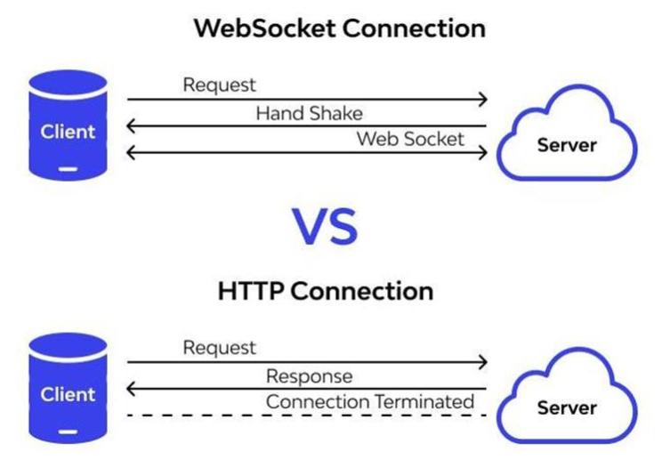

# Xây dựng real time chat app (P3)

# Kiến thức đạt được sau bài viết này

- Biết cơ bản về Error Handling
- Upload file - Serve static file
- Xây dựng middleware
- WebSocket

# Hướng dẫn

## Cài đặt các crate cần thiết

 `Cargo.toml` 

```toml
axum = {version = "0.7.5", features = ["multipart"]}
socketioxide = {version = "0.13.1", features = ["tracing"]}
tower = "0.4.13"
tower-http = {version = "0.5.2", features=["cors", "fs", "trace"]}
thiserror = "1.0.61"
```

- axum
    - multipart → upload file
- thiserror → hỗ trợ Error Handling
- tower → tạo các service (middleware)
- tower-http: cung cấp các middleware thường sử dụng cho HTTP
    - cors
    - fs → serve static file
    - trace → log thông tin request đến
- socketioxie: hỗ trợ socket bên phía server
    - tracing: in ra log

## Error handling

Đây là cheatsheet tổng hợp về các function xử lý cho `Result` enum [rust-error-cheatsheet.md (github.com)](https://gist.github.com/e-t-u/70f25d4566468adc43a4df43667cedb6)

Hoặc mọi người có thể xem tại

- [Result in std::result - Rust (rust-lang.org)](https://doc.rust-lang.org/std/result/enum.Result.html)
- [Option in std::option - Rust (rust-lang.org)](https://doc.rust-lang.org/std/option/enum.Option.html)

Trong bài viết trước, như mình đã đề cập có những function mình `unwrap` tận 2 lần mà nếu giá trị là `None` đối với `Option` hoặc `Err` đối với `Result` thì sẽ bị `panic` (crash chương trình)

Thông thường đối với unrecoverable error (lỗi không thể phục hồi) như thế này thì ta phải chuyển nó thành recoverable error (lỗi có thể phục hồi) hoặc trả lỗi về nhưng không làm crash chương trình

Có nhiều cách để xử lý lỗi như `match`,… `Nhược điểm` khi sử dụng match để xử lý lỗi là sẽ có trường hợp nhiều match lồng nhau (match hell)

⇒ Có thể sử dụng các chain method được implement cho `Option` hoặc `Result` để xử lý lỗi

- map_err: map Error type hiện tại trong Result sang một Error type khác
- ok_or_else: map từ Option sang Result với Err type sẽ được xác định với giá trị trả về trong closure

Mình thường chuyển Option về Result để xử lý lỗi.

Mọi người tạo file `error.rs` ở thư mục gốc

```rust
use axum::{
    http::StatusCode,
    response::{IntoResponse, Response},
    Json,
};
use serde::Serialize;
use thiserror::Error;

pub type Result<T> = std::result::Result<T, Error>;

#[derive(Debug, Error)]
pub enum Error {
    // Environment variable errors
    #[error("Environment variable {0} not found")]
    EnvVarNotFound(String),

    // Database errors
    #[error("Database connection failed")]
    DatabaseConnectionFailed,
    #[error("Insert failed: {0}")]
    InsertFailed(#[source] sea_orm::error::DbErr),
    #[error("Query failed {0}")]
    QueryFailed(#[source] sea_orm::error::DbErr),
    #[error("Update failed: {0}")]
    UpdateFailed(#[source] sea_orm::error::DbErr),
    #[error("Record not found")]
    RecordNotFound,
    #[error("Delete failed: {0}")]
    DeleteFailed(#[source] sea_orm::error::DbErr),

    // File errors
    #[error("Create file failed")]
    CreateFileFailed,

    #[error("File type invalid")]
    FileTypeInvalid,

    // JWT errors
    #[error("JWT decode failed: {0}")]
    DecodeJwtFailed(String),

		// Auth errors
    #[error("Please login first")]
    TokenNotFound,
}

impl IntoResponse for Error {
    fn into_response(self) -> Response {
        #[derive(Serialize)]
        struct ErrorResp {
            status: String,
            message: String,
        }

        (
            StatusCode::INTERNAL_SERVER_ERROR,
            Json(ErrorResp {
                status: StatusCode::INTERNAL_SERVER_ERROR.to_string(),
                message: self.to_string(),
            }),
        )
            .into_response()
    }
}

```

- `#[error()]` : implement trait Display ⇒ khi gọi to_string() thì sẽ in ra nội dung như khai báo trong macro
    - `#[source]` : mình định nghĩa high level error trong Error type của mình để end-user có thể hiểu và macro này sẽ xác định low level error khiến chương trình gặp lỗi

```rust
pub type Result<T> = std::result::Result<T, Error>;
```

Đây là 1 best practice mà mình thấy mọi người thường sử dụng. Mình sẽ alias cho type `Result` của mình với generic type E của `Err` là `Error` do mình định nghĩa

Sau đó mọi người sẽ implement trait IntoResponse cho Error do mình định nghĩa

```rust
impl IntoResponse for Error {
    fn into_response(self) -> Response {
        #[derive(Serialize)]
        struct ErrorResp {
            status: String,
            message: String,
        }

        (
            StatusCode::INTERNAL_SERVER_ERROR,
            Json(ErrorResp {
                status: StatusCode::INTERNAL_SERVER_ERROR.to_string(),
                message: self.to_string(),
            }),
        )
            .into_response()
    }
}
```

Sau đó mình sẽ chỉnh sửa lại `return type` cho các `handler function` sẽ return về `Result` của mình thì khi handler function trả về `Err(Error)` thì hàm `into_response` của Error sẽ được gọi và trả về client

Nhắc lại về `?` operator

- Giống unwrap nhưng bắt buộc function phải trả về `Result`
- Nếu gặp lỗi thì sẽ return về `Err(Error)`(thoát khỏi function) cho caller

Bây giờ mình sẽ xử lý lỗi ở các file trước đó mà mình chỉ sử dụng mỗi unwrap

**Lưu ý**: nếu mọi người muốn xem file code hoàn chỉnh thì mọi người có thể vào repo để xem chi tiết nhé ở đây mình chỉ show những phần thay đổi liên quan đến error handling cho mọi người dễ theo dõi

`main.rs`

```rust
// ...

mod error;

use error::{Error, Result};

#[tokio::main]
async fn main() -> Result<()> {
    // ...

    let opt = ConnectOptions::new(
        env::var("DATABASE_URL").map_err(|_| Error::EnvVarNotFound("DATABASE_URL".to_string()))?,
    );

    let db_connection = Database::connect(opt)
        .await
        .map_err(|_| Error::DatabaseConnectionFailed)?;

    // ...

    Ok(())
}
```

`src/features/users/handler.rs`

```rust
use crate::error::{Error, Result};

pub async fn create_user(
    // ...
) -> Result<impl IntoResponse> {
    // ...

    user_model
        .insert(&db_connection)
        .await
        .map_err(|e| Error::InsertFailed(e))?;

    Ok((
        StatusCode::CREATED,
        Json(json!(
            {
                "message": "User created successfully"
            }
        )),
    ))
}

pub async fn get_user_by_id(
    // ...
) -> Result<impl IntoResponse> {
    let user = user::Entity::find()
        .filter(Condition::all().add(user::Column::Id.eq(id)))
        .one(&db_connection)
        .await
        .map_err(|e| Error::QueryFailed(e))?
        .ok_or_else(|| Error::RecordNotFound)?;

    // ...

    Ok((StatusCode::OK, Json(result)))
}

pub async fn update_user(
    // ...
) -> Result<impl IntoResponse> {
    let mut user: user::ActiveModel = user::Entity::find()
        .filter(Condition::all().add(user::Column::Id.eq(id)))
        .one(&db_connection)
        .await
        .map_err(|e| Error::QueryFailed(e))?
        .ok_or_else(|| Error::RecordNotFound)?
        .into();

	  // ...
	  
	  user.update(&db_connection)
        .await
        .map_err(|e| Error::UpdateFailed(e))?;

    Ok((
        StatusCode::ACCEPTED,
        Json(json!(
            {
                "message": "User updated successfully"
            }
        )),
    ))
}

pub async fn delete_user(
    // ...
) -> Result<impl IntoResponse> {
    let user = user::Entity::find()
        .filter(Condition::all().add(user::Column::Id.eq(id)))
        .one(&db_connection)
        .await
        .map_err(|e| Error::QueryFailed(e))?
        .ok_or_else(|| Error::RecordNotFound)?;

    user::Entity::delete_by_id(user.id)
        .exec(&db_connection)
        .await
        .map_err(|e| Error::DeleteFailed(e))?;

    Ok((
        StatusCode::NO_CONTENT,
        Json(json!(
            {
                "message": "User deleted successfully"
            }
        )),
    ))
}

pub async fn get_all_users(
    // .
) -> Result<impl IntoResponse> {
    let users: Vec<UserDTO> = user::Entity::find()
        .all(&db_connection)
        .await
        .map_err(|e| Error::QueryFailed(e))?
        .into_iter()
        .map(|user| UserDTO {
            id: user.id,
            name: user.name,
            email: user.email,
            avatar: user.avatar,
            is_online: user.is_online,
        })
        .collect();

    Ok((StatusCode::OK, Json(users)))
}
```

`src/features/group/handler.rs`

```rust
use crate::error::{Error, Result};

pub async fn create_group(
    // ...
) -> Result<impl IntoResponse> {
    // ...
    let new_group = group_model
        .insert(&db_connection)
        .await
        .map_err(|e| Error::InsertFailed(e))?;

    // ...

    user_group::Entity::insert_many(records)
        .exec(&db_connection)
        .await
        .map_err(|e| Error::InsertFailed(e))?;

    Ok((
        StatusCode::CREATED,
        Json(json!(
            {
                "message": "Group created successfully"
            }
        )),
    ))
}

pub async fn get_group_by_id(
    // ...
) -> Result<impl IntoResponse> {
    let group = group::Entity::find()
        .filter(Condition::all().add(group::Column::Id.eq(id)))
        .one(&db_connection)
        .await
        .map_err(|e| Error::QueryFailed(e))?
        .ok_or_else(|| Error::RecordNotFound)?;

    let user_ids: Vec<Uuid> = user_group::Entity::find()
        .filter(Condition::all().add(user_group::Column::GroupId.eq(group.id)))
        .all(&db_connection)
        .await
        .map_err(|e| Error::QueryFailed(e))?
        .into_iter()
        .map(|user_group_model| user_group_model.user_id)
        .collect();

    let mut users: Vec<UserDTO> = vec![];
    for user_id in user_ids.into_iter() {
        let user = user::Entity::find()
            .filter(Condition::all().add(user::Column::Id.eq(user_id)))
            .one(&db_connection)
            .await
            .map_err(|e| Error::QueryFailed(e))?
            .ok_or_else(|| Error::RecordNotFound)?;
        // ...
    }

    // ...

    Ok((StatusCode::OK, Json(result)))
}
```

`src/features/chat/handler.rs` 

```rust
use crate::error::{Error, Result}

pub async fn chat(
    // ...
) -> Result<impl IntoResponse> {
    // ...

    let message = message_model
        .insert(&db_connection)
        .await
        .map_err(|e| Error::InsertFailed(e))?;

    // ...
    
    conversation_model
        .insert(&db_connection)
        .await
        .map_err(|e| Error::InsertFailed(e))?;

    Ok((
        StatusCode::CREATED,
        Json(json!(
            {
                "message": "Chat created successfully"
            }
        )),
    ))
}
```

Mình chưa xử lý lỗi cho feature auth vì mình cẩn tổ chức lại code 1 tí ở phần sau `Middleware` 

## Middleware

Trước khi xây dựng middleware để check trong request có token gửi lên cùng hay không để xác minh danh tính của người gửi request thì mình muốn tách cái phần logic liên quan đến JWT ra 1 file riêng được đặt trong thư mục `utils`

Mọi người tạo folder `utils` ở thư mục gốc và tạo file `jwt.rs`. Sau đó mọi người chuyển các phần code liên quan đến JWT trước đó qua file này

**Mục đích:** tách biệt phần xử lý logic cho feature auth và cho JWT riêng 

Mình sẽ lưu secret key ở `.env` 

```bash
JWT_SECRET=my_secret
```

`src/utils/jwt.rs`

```rust
use std::env;

use jsonwebtoken::{decode, encode, DecodingKey, EncodingKey, Header, Validation};
use serde::{Deserialize, Serialize};
use uuid::Uuid;

use crate::error::{Error, Result};

pub fn encode_jwt(user_id: Uuid) -> Result<String> {
    let claims = Claims {
        sub: String::from("Login Token"),
        exp: (chrono::Utc::now() + chrono::Duration::days(1)).timestamp() as usize,
        user_id,
    };

    let secret =
        env::var("JWT_SECRET").map_err(|_| Error::EnvVarNotFound("JWT_SECRET".to_string()))?;

    let token = encode(
        &Header::default(),
        &claims,
        &EncodingKey::from_secret(secret.as_ref()),
    )
    .unwrap();

    Ok(token)
}

pub fn decode_jwt(token: String) -> Result<Uuid> {
    let secret =
        env::var("JWT_SECRET").map_err(|_| Error::EnvVarNotFound("JWT_SECRET".to_string()))?;

    let Claims {
        user_id,
        sub: _,
        exp: _,
    } = decode::<Claims>(
        &token,
        &DecodingKey::from_secret(secret.as_ref()),
        &Validation::default(),
    )
    .map_err(|e| Error::DecodeJwtFailed(e.to_string()))?
    .claims;

    Ok(user_id)
}

#[derive(Serialize, Deserialize)]
pub struct Claims {
    pub sub: String, // the subject of the token
    pub exp: usize,  // the expiry time
    pub user_id: Uuid,
}
```

Ở function `decode_jwt` mình chuyển từ `match` sang `map_err` để xử lý lỗi vì `match` làm code dài dòng

Sau đó mình sửa lại function `login` và xóa đi function `verify` (trước sử dụng để test decode token)

`src/features/auth/handler.rs`

```rust
use axum::{http::StatusCode, response::IntoResponse, Extension, Json};

use sea_orm::{ColumnTrait, DatabaseConnection, EntityTrait, QueryFilter};

use entity::user;

use crate::{
    error::{Error, Result},
    utils::jwt,
};

use super::model::{LoginRequest, LoginResponse};

pub async fn login(
    Extension(db_connection): Extension<DatabaseConnection>,
    Json(payload): Json<LoginRequest>,
) -> Result<impl IntoResponse> {
    let LoginRequest { email, password } = payload;

    let user = user::Entity::find()
        .filter(user::Column::Email.eq(email))
        .filter(user::Column::Password.eq(password))
        .one(&db_connection)
        .await
        .map_err(|e| Error::QueryFailed(e))?
        .ok_or(Error::RecordNotFound)?;

    let token = jwt::encode_jwt(user.id)?;

    let resp = LoginResponse {
        msg: String::from("Login Successfully!"),
        token: token,
    };

    Ok((StatusCode::CREATED, Json(resp)))
}
```

Trước khi chat thì mình phải đăng nhập để server định danh được đây là ai và để kiểm tra xem người dùng đã đăng nhập chưa thì mình sẽ định nghĩa 1 middleware kiểm tra request này có `header authentication` gửi lên cùng token không?

`src/features/auth/middleware.rs`

```rust
use axum::{
    extract::Request,
    http::{header::AUTHORIZATION, HeaderMap},
    middleware::Next,
    response::IntoResponse,
};
use sea_orm::{DatabaseConnection, EntityTrait};

use crate::{
    error::{Error, Result},
    utils::jwt::decode_jwt,
};

use entity::user;

pub async fn check_login(
    headers: HeaderMap,
    mut req: Request,
    next: Next,
) -> Result<impl IntoResponse> {
    let token = headers
        .get(AUTHORIZATION)
        .ok_or_else(|| Error::TokenNotFound)?
        .to_str()
        .or_else(|e| Err(Error::Unknown(e.to_string())))?;

    let token = token.replace("Bearer ", "");

    let user_id = decode_jwt(token)?;

    let db_connection = req
        .extensions()
        .get::<DatabaseConnection>()
        .ok_or_else(|| Error::DatabaseConnectionFailed)?;

    let user = user::Entity::find_by_id(user_id)
        .one(db_connection)
        .await
        .map_err(|e| Error::QueryFailed(e))?
        .ok_or_else(|| Error::RecordNotFound)?;

    req.extensions_mut().insert(user.id);

    let res = next.run(req).await;

    Ok(res)
}
```

**Lưu ý**: 

- function sử dụng làm middleware phải là async function
- Thứ tự các tham số của middleware function
    - Các extractor (HeaderMap, Json,…) là các tham số đứng đầu
    - `Request` luôn là tham số đứng sau Next
    - `Next` là tham số cuối cùng

```rust
let db_connection = req
        .extensions()
        .get::<DatabaseConnection>()
        .ok_or_else(|| Error::DatabaseConnectionFailed)?;
```

Hoặc có thể dùng `Extension` extractor để truy cập dữ liệu được chia sẻ giữa các handler, middleware

```rust
req.extensions_mut().insert(user_id);
```

**Lưu ý**: `user_id` chỉ tồn tại trong 1 chu kì request/response, sau khi request được xử lý xong và response được gửi về client thì `req` object (bao gồm cả extension) sẽ bị xóa đi

```rust
let res = next.run(req).await;
```

`Request` object tiếp tục đi đến các middleware tiếp theo trong middleware stack và handler function

Bây giờ những router hoặc route nào cần middleware này thì thêm vào 

`src/features/chat/routes.rs`

```rust
use axum::{middleware, routing::post, Router};

use crate::features::auth::middleware::check_login;

use super::handler::chat;

pub fn get_routes() -> Router {
    Router::new()
        .route("/", post(chat))
        .layer(middleware::from_fn(check_login))
}
```

`src/features/group/routes.rs` 

```rust
use axum::{
    middleware,
    routing::{get, post},
    Router,
};

use crate::features::auth::middleware::check_login;

use super::handler::{create_group, get_group_by_id};

pub fn get_routes() -> Router {
    let protected_routes = Router::new()
        .route("/", post(create_group))
        .layer(middleware::from_fn(check_login));
    let public_routes = Router::new().route("/:id", get(get_group_by_id));

    Router::new().merge(public_routes).merge(protected_routes)
}
```

Mình sẽ tách làm 2 router

- protected: cần phải đăng nhập thì mới truy cập được
- public: truy cập thoải mái

## Upload file - Serve static file

Mọi người tạo folder `public` ở thư mục gốc nhé. Đây là folder chứa các file upload và static file mà client có thể truy cập đến. Mọi người tạo folder con của `public` là `uploads` để lưu các file upload ở đây

### Upload file

Mọi người thêm các crate sau vào `Cargo.toml` 

- `mime` chứa các constant về content type
- `regex` để hỗ trợ lấy các chuỗi dựa trên pattern

```jsx
mime = "0.3.17"
regex = "1.10.4"
```

`src/features/users/handler.rs`

```rust
pub async fn update_avatar(
    Extension(db_connection): Extension<DatabaseConnection>,
    Path(id): Path<Uuid>,
    mut multipart: Multipart,
) -> Result<impl IntoResponse> {
    while let Some(field) = multipart.next_field().await.unwrap() {
        let field_name = field.name().unwrap().to_string();

        if field_name == "avatar" {
            let file_name = field.file_name().unwrap();
            let content_type = field.content_type().unwrap();

            let regex = Regex::new(mime::IMAGE_STAR.as_ref()).unwrap();

            if regex.is_match(&content_type) {
                let mut user: user::ActiveModel = user::Entity::find()
                    .filter(Condition::all().add(user::Column::Id.eq(id)))
                    .one(&db_connection)
                    .await
                    .map_err(|e| Error::QueryFailed(e))?
                    .ok_or_else(|| Error::RecordNotFound)?
                    .into();

                user.avatar = Set(Some(file_name.to_string()));

                let mut file = File::create(format!("./public/uploads/{file_name}"))
                    .await
                    .map_err(|_| Error::CreateFileFailed)?;
                let data = field.bytes().await.unwrap();
                file.write(&data).await.unwrap();

                user.update(&db_connection)
                    .await
                    .map_err(|e| Error::UpdateFailed(e))?;
            } else {
                return Err(Error::FileTypeInvalid);
            }
        }
    }

    Ok((
        StatusCode::OK,
        Json(json!({ "message": "Avatar updated successfully" })),
    ))
}
```

Multipart extractor có được do thêm feature `multipart` ở crate `axum` 

```rust
mut multipart: Multipart,
```

Tại sao multipart lại có `mut` như mọi người xem qua code thì đâu có chỗ nào mình thay đổi cho multipart?

**Giải thích**: Trong struct Multipart có 1 field `inner` (có thể hiểu như con trỏ) để truy cập từng đoạn byte (block data) ứng với các field được gửi lên trong HTTP Request Body

Ví dụ: Mình có form-data như sau

- id: 123
- name: Alex
- avatar: img.png

Tất cả các field đều có giá trị ở dạng stream (byte) ⇒ multipart sẽ chia thành từng đoạn stream ứng với từng field và có “con trỏ” để truy cập đến từng đoạn stream đó ⇒ multipart bị thay đổi (do “con trỏ” thay đổi)

`while let` nếu gặp giá trị `None` thì sẽ break khỏi vòng lặp

Mình sẽ sử dụng module `file` của crate `tokio` để chạy async còn module `file` của `std` là chạy sync nhé

### Serve static file

`fallback_service` khi request không vào được bất kỳ route nào thì nó sẽ vào cái service (middleware) này

`tower-http` cung cấp sẵn middleware để serve static file và mình chỉ cần truyền tên folder mà mình muốn public

`main.rs` 

```rust
let app = create_router().layer(Extension(db_connection))
        .fallback_service(ServeDir::new("public"));
```

# WebSocket

- WebSocket cho phép giao tiếp song song hai chiều giữa client và server (giao tiếp hai chiều nghĩa là ở mô hình client-server thì client sẽ gửi request lên server rồi server response về dữ liệu tuy nhiên với WebSocket client hay server đều có thể gửi dữ liệu đến và response dữ liệu cho bên còn lại bằng cách phát ra sự kiện)
- Kết nối giữa client và server sẽ tồn tại cho đến khi một trong hai bên chấm dứt kết nối. Sau khi đóng kết nối bởi một trong hai máy, kết nối sẽ bị chấm dứt cả hai đầu.



Luồng hoạt động


Mô tả luồng hoạt động chung cho các chức năng có sử dụng WebSocket:

- Bước 1: Client phát ra sự kiện
- Bước 2: Server lắng nghe được sự kiện này và gọi hàm xử lý sự kiện tương ứng
- Bước 3: Nếu hàm xử lý cần tương tác với cơ sở dữ liệu thì tiến hành lấy, thêm, sửa, xóa dữ liệu
- Bước 4: Database Server trả response về server (app)
- Bước 5: Sau đó Server sẽ phát ra sự kiện để cho client có thể update lại
- Bước 6: Client lắng nghe sự kiện được phát ra từ server và gọi hàm xử lý tương ứng

Mình chỉ tập trung xử lý socket bên phía server ngoài ra crate `socketioxide` tương thích với socket.io client

```rust
use std::env;

use axum::{http::HeaderValue, Extension};
use dotenv::dotenv;

pub mod enums;
pub mod features;

mod error;
mod router;
mod socket;
mod utils;

use router::create_router;
use sea_orm::{ConnectOptions, Database};
use socketioxide::SocketIo;
use tower::ServiceBuilder;
use tower_http::trace::TraceLayer;
use tower_http::{cors::CorsLayer, services::ServeDir};

use socket::on_connect;

use error::{Error, Result};

#[tokio::main]
async fn main() -> Result<()> {
    // ...

    let (layer, io) = SocketIo::new_layer();

    io.ns("/", on_connect.with(check_login));

    // build our application with a route
    let app = create_router()
        .fallback_service(ServeDir::new("public"))
        .layer(
            ServiceBuilder::new()
                .layer(TraceLayer::new_for_http())
                .layer(CorsLayer::new().allow_origin("*".parse::<HeaderValue>().unwrap()))
                .layer(Extension(db_connection))
                .layer(layer),
        );

    // ...

    Ok(())
}

```

**Lưu ý**: phải đặt `fallback_service` lên trên `socket` layer nếu không thì request sẽ không thể truy cập vào socket server

Thiết lập socket server

- `SocketIoLayer`: middleware kiểm tra request gửi lên server có liên quan tới socket không, xong sẽ điều hướng các request này đến handler socket tương ứng
- `SocketIo` xử lý toàn bộ socket.io context (phát sự kiện và gửi data về client, nhận sự kiện và data gửi lên từ client,….)

Các middleware mới mà mình sử dụng

- `TraceLayer`: log các thông tin liên quan đến request (`tower-http` cung cấp)
- `CorsLayer`: cho phép client khác domain có thể truy cập vào resource của server thay vì lỗi cors do cơ chế của browser (`tower-http` cung cấp)

Ở đây mình sử dụng `ServiceBuilder`  để kết hợp các middleware layer thành 1 layer. Mọi người nên đặt các middleware trong đây thay vì đặt riêng lẻ bên ngoài 

Vì nếu không đặt các middleware trong `ServiceBuilder` thì thứ tự request đi qua các middleware sẽ là từ dưới lên trên như trong hình

```rust
use axum::{routing::get, Router};

async fn handler() {}

let app = Router::new()
    .route("/", get(handler))
    .layer(layer_one)
    .layer(layer_two)
    .layer(layer_three);
```


Còn nếu sử dụng `ServiceBuilder` thì request sẽ đi qua middleware từ trên xuống dưới

Nếu gặp lỗi thì nó sẽ return lỗi về luôn tại middleware đó mà không đi đến middleware layer kế tiếp

Còn next thì sẽ đi đến middleware tiếp theo trong stack nếu còn, còn không sẽ đi đến handler function rồi handler function xử lý trả về response sau đó response sẽ đi qua các middleware function trước đó

Mình tạo folder `socket` ở thư mục gốc. Sau đó định nghĩa function `on_connect` đây là function xử lý một socket client kết nối thành công đến server và quản lý việc phát sự kiện đến client, nhận sự kiện từ client,…

`mod.rs` 

```rust
use socketioxide::extract::SocketRef;
use tracing::info;

use crate::socket::handler::{handle_join, handle_message};

pub mod handler;
pub mod model;

pub async fn on_connect(socket: SocketRef) {
    info!("socket connected {}", socket.id);

    socket.on("message", handle_message);
    socket.on("join", handle_join);
    socket.on_disconnect(handler_disconnect)
}
```

Mình có thêm middleware check người dùng đã đăng nhập chưa trước khi socket connect đến server `io.ns("/", on_connect.with(check_login));` 

- Nếu kết quả trả về là `Ok(())`, middleware tiếp theo sẽ được gọi hoặc nếu không còn middleware nào nữa, socket sẽ được kết nối.
- Nếu kết quả trả về là lỗi, kết nối namespace sẽ bị từ chối và lỗi sẽ được trả về.

`src/socket/mod.rs`

```rust
// middleware
pub async fn check_login(socket: SocketRef) -> Result<()> {
    let token = socket
        .req_parts()
        .headers
        .get(AUTHORIZATION)
        .ok_or_else(|| Error::TokenNotFound)?
        .to_str()
        .or_else(|e| Err(Error::Unknown(e.to_string())))?;

    Ok(())
}
```

`src/socket/handler.rs` 

```rust
use sea_orm::DatabaseConnection;
use socketioxide::{
    extract::{Data, SocketRef},
    socket::DisconnectReason,
};
use tracing::info;

use crate::{
    error::Error,
    features::chat::{model::Chat, service::insert_chat},
    socket::model::MessageOut,
};

use super::model::JoinRoom;

pub async fn handle_message(socket: SocketRef, Data(data): Data<Chat>) {
    let db_connection = socket
        .req_parts()
        .extensions
        .get::<DatabaseConnection>()
        .ok_or_else(|| Error::DatabaseConnectionFailed)
        .unwrap();

    let _ = insert_chat(db_connection.to_owned(), data.clone()).await;

    let resp = MessageOut {
        content: data.content,
        user_id: data.user_id,
        group_id: data.group_id,
        created_at: chrono::Utc::now(),
    };

    socket
        .within(data.group_id.to_string())
        .emit("message-back", resp)
        .ok();
}

pub fn handle_join(socket: SocketRef, Data(data): Data<JoinRoom>) {
    info!("Received join: {:?}", data);

    let _ = socket.leave_all(); // before joining a new room, leave all rooms
    let _ = socket.join(data.room.to_string());

    socket
        .within(data.room.to_string())
        .emit("join-room-back", data)
        .ok();
}

pub async fn handler_disconnect(socket: SocketRef, reason: DisconnectReason) {
    println!("Socket {} was disconnected because {} ", socket.id, reason);
}

```

- Các handler function trong socket có thể `aysnc` hoặc `sync` và có thể nhận từ `0`  đến `16` tham số
- Trong trường hợp deserialization gặp lỗi thì handler sẽ không được gọi nên mọi người sử dụng `TryData` extractor để có thể xử lý lỗi thay vì `Data` extractor. Trong trường hợp này mình sẽ sử dụng `Data` extractor cho nhanh nhé.

Có 2 event mình cần xử lý khi client gửi lên server

- join


Các socket nằm trong cùng 1 room thì khi server emit event đến room đó thì chỉ các socket trong room đó bắt được sự kiện do server phát ra

- message

Mọi người nhận thấy phần logic cho chức năng chat mình đã định nghĩa trước đó có thể tái sử dụng ở đây nên mình sẽ tách phần logic đó ra 1 file riêng là `src/features/chat/service.rs` 

Mọi người truy cập vào file `src/features/chat/handler.rs` và lấy phần xử lý logic đưa vào file `src/features/chat/service.rs`

```rust
use entity::sea_orm_active_enums::MessageEnum;
use sea_orm::ActiveValue::Set;
use sea_orm::{ActiveModelTrait, DatabaseConnection};

use entity::{conversation, message};

use crate::error::{Error, Result};

use super::model::{Chat, MessageType};

pub async fn insert_chat(db_connection: DatabaseConnection, payload: Chat) -> Result<()> {
    let message_type = match payload.message_type {
        MessageType::File => MessageEnum::File,
        MessageType::Text => MessageEnum::Text,
        MessageType::Image => MessageEnum::Image,
    };

    let message_model = message::ActiveModel {
        user_id: Set(payload.user_id),
        content: Set(payload.content),
        r#type: Set(Some(message_type)),
        ..Default::default()
    };

    let message = message_model
        .insert(&db_connection)
        .await
        .map_err(|e| Error::InsertFailed(e))?;

    let conversation_model = conversation::ActiveModel {
        group_id: Set(payload.group_id),
        msg_id: Set(message.id),
    };

    conversation_model
        .insert(&db_connection)
        .await
        .map_err(|e| Error::InsertFailed(e))?;

    Ok(())
}
```

Sau đó mình sửa lại file `src/features/chat/handler.rs`

```rust
use axum::{http::StatusCode, response::IntoResponse, Extension, Json};

use sea_orm::DatabaseConnection;
use serde_json::json;

use crate::error::Result;

use super::model::Chat;
use super::service::insert_chat;

pub async fn chat(
    Extension(db_connection): Extension<DatabaseConnection>,
    Json(payload): Json<Chat>,
) -> Result<impl IntoResponse> {
    insert_chat(db_connection, payload).await?;

    Ok((
        StatusCode::CREATED,
        Json(json!(
            {
                "message": "Chat created successfully"
            }
        )),
    ))
}

```

Mình cần thêm macro `Clone` cho struct `Chat` để có thể gọi được `clone()` và `Debug` để có thể in ra và để thêm được các macro đó cho Chat thì ta cũng phải thêm các macro đó cho `MessageType`

```rust
use serde::Deserialize;
use uuid::Uuid;

#[derive(Deserialize, Debug, Clone)]
pub struct Chat {
    pub user_id: Uuid,
    pub content: String,
    pub message_type: MessageType,
    pub group_id: Uuid,
}

#[derive(Deserialize, Debug, Clone)]
pub enum MessageType {
    File,
    Text,
    Image,
}
```

`src/socket/model.rs` 

```rust
use serde::{Deserialize, Serialize};
use uuid::Uuid;

// for FE to render the message
#[derive(Debug, Serialize)]
pub struct MessageOut {
    pub content: String,
    pub user_id: Uuid,
    pub group_id: Uuid,
    pub created_at: chrono::DateTime<chrono::Utc>,
}

#[derive(Debug, Serialize, Deserialize)]
pub struct JoinRoom {
    pub room: Uuid, // group_id
}
```

Mọi người có thể sử dụng Postman để kiểm tra Socket


**Lưu ý:** nhớ set `JSON` để gửi data nhé không sẽ bị lỗi mà nó không hiển thị lỗi

## Github

Mọi người có thể xem source code hoàn chỉnh ở đây nhé.

[https://github.com/Learning-Tech-Workspace/learn-rust-backend](https://github.com/Learning-Tech-Workspace/learn-rust-backend)

## Postman

[https://www.postman.com/navigation-astronaut-22006281/workspace/rust](https://www.postman.com/navigation-astronaut-22006281/workspace/rust)

## Tổng kết

Trong bài viết này ta đã:

- Xử lý lỗi
- Upload file - Serve static file
- Xây dựng middleware kiểm tra người dùng đã đăng nhập chưa
- WebSocket

Đây là phần cuối cùng trong serise bài viết xây dựng ứng dụng realtime chat app với Rust nhé. Mình chủ yếu giới thiệu về mặt kỹ thuật nên các chức năng chưa hoàn chỉnh, mọi người có thể phát triển lên tiếp theo ý muốn của bản thân nhé. Cảm ơn mọi người đã theo dõi series. Hẹn mọi người ở những bài viết tiếp theo ^^

Mình chưa có quá nhiều kinh nghiệm với Rust trong việc xây dựng Backend. Trong bài viết có sai sót gì mọi người cùng thảo luận góp ý nhé.

Cảm ơn mọi người đã đọc.