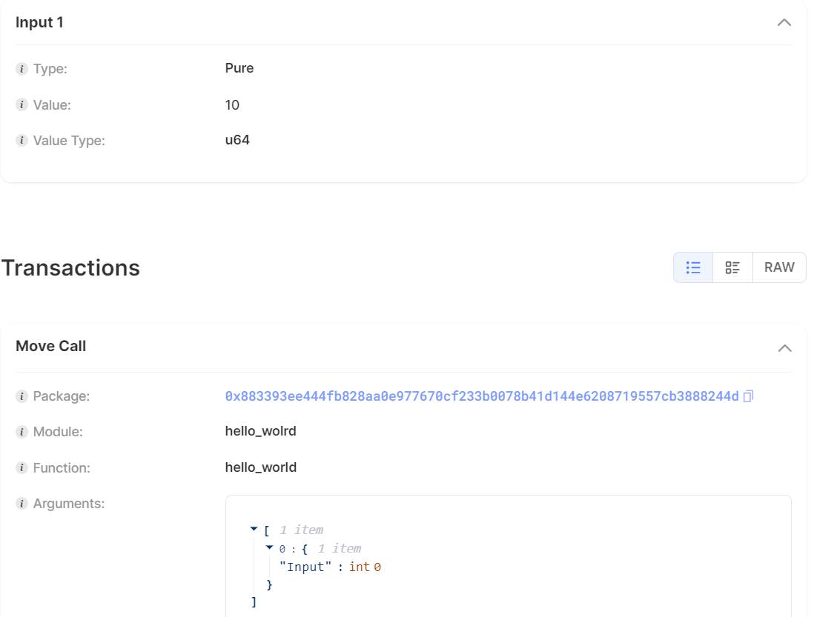

# Connect Sui Blockchain with Rust

Xin chào mọi người mình là [SaitamaCoder](https://github.com/FucktheKingcode) đây! Dạo gần đây mình có 1 task làm về backend với đề là làm sao kết nối với Sui Blockchain. Mà cay thật là trong docs của Sui SDKs không có giới thiệu về hàm MoveCall của nó trong Rust.
Thế là qua nhiều ngày nằm cay nếm mật, thẩm d... với cái lib của nó vậy nên mình mới có thể thành công được. Thôi không dài dòng triển ngay luôn nào!

# Kiến thức yêu cầu

- Biết cơ bản về Rust
- Biết cơ bản về Sui Blockchain
- Hiểu về thư viện Sui SDKs (đặc biệt là Rust SDK của nó)

# Kết quả đạt được sau bài này

- Hiểu được cách để gọi các hàm trong module của Sui Blockchain.
- Hiểu thêm về cách tạo một Object với Rust

# Hướng dẫn

# Thêm thư các thư viện sau vào file Cargo.toml:

```toml
    sui-sdk = { git = "https://github.com/mystenlabs/sui", package = "sui-sdk"}
    sui-config = { git = "https://github.com/mystenlabs/sui", package = "sui-config"}
    sui-json-rpc-types = { git = "https://github.com/mystenlabs/sui", package = "sui-json-rpc-types"}
    sui-keys = { git = "https://github.com/mystenlabs/sui", package = "sui-keys"}
    shared-crypto = { git = "https://github.com/mystenlabs/sui", package = "shared-crypto"}
    tokio = { version = "1.2", features = ["full"] }
    anyhow = "1.0"
    futures = "0.3.30"
    tracing = "0.1.40"
    reqwest = "0.12.4"
    serde_json = "1.0.117"
    serde = "1.0.203"
    bcs = "0.1.6"
```

# Tạo file util.rs như sau:

Đây là đoạn code dùng để tạo hàm setup_for_write() và retrieve_wallet() theo hướng dẫn của Mysten Labs cung cấp để có thể nhận diện được ví Sui trong máy tính và dùng nó để tương tác với Sui blockchain.

```rust
// SPDX-License-Identifier: Apache-2.0

use sui_config::{
    sui_config_dir, Config, PersistedConfig, SUI_CLIENT_CONFIG, SUI_KEYSTORE_FILENAME,
};
use sui_keys::keystore::{AccountKeystore, FileBasedKeystore};
use sui_sdk::{
    sui_client_config::{SuiClientConfig, SuiEnv},
    wallet_context::WalletContext,
};
use tracing::info;

use sui_sdk::types::{
    base_types::SuiAddress,
    crypto::SignatureScheme::ED25519,
};
use sui_sdk::{SuiClient, SuiClientBuilder};

pub async fn setup_for_write() -> Result<(SuiClient, SuiAddress, SuiAddress), anyhow::Error> {
    let (client, active_address) = setup_for_read().await?;
    let wallet = retrieve_wallet()?;
    let addresses = wallet.get_addresses();
    let addresses = addresses
        .into_iter()
        .filter(|address| address != &active_address)
        .collect::<Vec<_>>();
    let recipient = addresses
        .first()
        .expect("Cannot get the recipient address needed for writing operations. Aborting");

    Ok((client, active_address, *recipient))
}

pub async fn setup_for_read() -> Result<(SuiClient, SuiAddress), anyhow::Error> {
    let client = SuiClientBuilder::default().build_testnet().await?;
    println!("Sui testnet version is: {}", client.api_version());
    let mut wallet = retrieve_wallet()?;
    assert!(wallet.get_addresses().len() >= 2);
    let active_address = wallet.active_address()?;

    println!("Wallet active address is: {active_address}");
    Ok((client, active_address))
}

pub fn retrieve_wallet() -> Result<WalletContext, anyhow::Error> {
    let wallet_conf = sui_config_dir()?.join(SUI_CLIENT_CONFIG);
    let keystore_path = sui_config_dir()?.join(SUI_KEYSTORE_FILENAME);

    if !keystore_path.exists() {
        let keystore = FileBasedKeystore::new(&keystore_path)?;
        keystore.save()?;
    }

    if !wallet_conf.exists() {
        let keystore = FileBasedKeystore::new(&keystore_path)?;
        let mut client_config = SuiClientConfig::new(keystore.into());

        client_config.add_env(SuiEnv::testnet());
        client_config.add_env(SuiEnv::devnet());
        client_config.add_env(SuiEnv::localnet());

        if client_config.active_env.is_none() {
            client_config.active_env = client_config.envs.first().map(|env| env.alias.clone());
        }

        client_config.save(&wallet_conf)?;
        info!("Client config file is stored in {:?}.", &wallet_conf);
    }

    let mut keystore = FileBasedKeystore::new(&keystore_path)?;
    let mut client_config: SuiClientConfig = PersistedConfig::read(&wallet_conf)?;

    let default_active_address = if let Some(address) = keystore.addresses().first() {
        *address
    } else {
        keystore
            .generate_and_add_new_key(ED25519, None, None, None)?
            .0
    };

    if keystore.addresses().len() < 2 {
        keystore.generate_and_add_new_key(ED25519, None, None, None)?;
    }

    client_config.active_address = Some(default_active_address);
    client_config.save(&wallet_conf)?;

    let wallet = WalletContext::new(&wallet_conf, Some(std::time::Duration::from_secs(60)), None)?;

    Ok(wallet)
}
```

# Bây giờ chúng ta đến bước quan trong nhất là gọi hàm trên Sui Blockchain

Ông bạn [Harry](https://github.com/hien-p) hiền lành của mình đã tạo một module trên Sui blokchain với cái tên đã được mã hóa dí dỏm là **"hello_wolrd"** và Package ID là "0x883393ee444fb828aa0e977670cf233b0078b41d144e6208719557cb3888244d". Trong module này có 2 hàm gồm một hàm "ping" không cần có tham số và một hàm là **"hello_world"** có 1 tham số kiểu U64.

## Đầu tiên chúng ta import các thư viện sau:

```rust
mod utils;
use shared_crypto::intent::Intent;
use sui_config::{sui_config_dir, SUI_KEYSTORE_FILENAME};
use sui_keys::keystore::{AccountKeystore, FileBasedKeystore};
use sui_sdk::{
    rpc_types::SuiTransactionBlockResponseOptions,
    types::{
        base_types::ObjectID, programmable_transaction_builder::ProgrammableTransactionBuilder, quorum_driver_types::ExecuteTransactionRequestType, transaction::{Argument, CallArg, Command, Transaction, TransactionData}, Identifier, TypeTag
    },
};
use utils::setup_for_write;
```

## Tương tác với Sui Blockchain bằng ví Sui Client

Mình sẽ lấy ra từ sui client ví người gọi giao dịch và người nhận (nếu có):

```rust
let (sui, sender, _ ) = setup_for_write().await?;
```

Chúng ta sẽ phải tìm coins của chúng ta trên ví để trả phí gas

```rust
let coins = sui
        .coin_read_api()
        .get_coins(sender, None, None, None)
        .await?;
let coin = coins.data.into_iter().next().unwrap();
```

Tạo một ProgrammableTransactionBuilder

```rust
let mut ptb = ProgrammableTransactionBuilder::new();
```

Vì trong Sui Blockchain everything là Object



Nên bạn muốn đưa vào một tham số để gọi hàm nào đó trong module thì cũng phải đưa nó về Object của Sui

```rust
let input_value = 10u64;
let input_argument = CallArg::Pure(bcs::to_bytes(&input_value).unwrap());
```

Chúng ta gán Object này vào mảng input trong Sui

```rust
ptb.input(input_argument);
```

Chúng ta gọi hàm MoveCall bằng ProgrammableTransactionBuilder như sau.

Lưu ý: Chúng ta truyền vào đúng index trong mảng input mà chúng ta đã truyền vào trước đó.
Trong ví dụ này mình truyền vào 1 tham số nên index là 0, còn nếu các bạn không có tham số nào thì không cần truyền gì hết "arguments: vec![Argument::Input(0)]" là được.

```rust
ptb.command(Command::MoveCall(Box::new(
        sui_sdk::types::transaction::ProgrammableMoveCall {
            package: ObjectID::from_hex_literal("0x883393ee444fb828aa0e977670cf233b0078b41d144e6208719557cb3888244d").unwrap(),
            module: Identifier::new("hello_wolrd").unwrap(),
            function: Identifier::new("hello_world").unwrap(),
            type_arguments: vec![],
            arguments: vec![Argument::Input(0)],
        }
    )));
```

Cuối cùng chúng ta kết thúc transaction này bằng cách gọi

```rust
let builder = ptb.finish();
```

Và cuối cuối cùng các bạn nhớ chạy lệnh sau để đưa transaction trên vào chuỗi nhé!
Lưu ý: Trong ví Sui Client của bạn phải có sui để trả phí gas nhé

```rust
let gas_budget = 10_000_000;
let gas_price = sui.read_api().get_reference_gas_price().await?;
// create the transaction data that will be sent to the network
let tx_data = TransactionData::new_programmable(
    sender,
    vec![coin.object_ref()],
    builder,
    gas_budget,
    gas_price,
);

// 4) sign transaction
let keystore = FileBasedKeystore::new(&sui_config_dir()?.join(SUI_KEYSTORE_FILENAME))?;
let signature = keystore.sign_secure(&sender, &tx_data, Intent::sui_transaction())?;

// 5) execute the transaction
print!("Executing the transaction...");
let transaction_response = sui
    .quorum_driver_api()
    .execute_transaction_block(
        Transaction::from_data(tx_data, vec![signature]),
        SuiTransactionBlockResponseOptions::full_content(),
        Some(ExecuteTransactionRequestType::WaitForLocalExecution),
    )
    .await?;
print!("done\n Transaction information: ");
println!("{:?}", transaction_response);
Ok(())
```

Cuối cùng cảm ơn các bạn đã xem và mình là [SaitamaCoder](https://github.com/FucktheKingcode), hy vọng gặp lại nhé!
