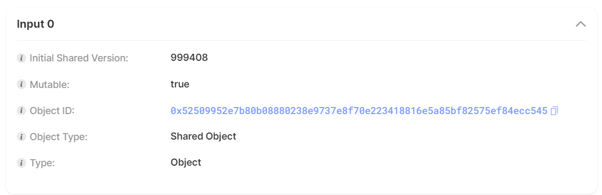

# Connect Sui Blockchain with Rust

Xin chào mọi người mình là [SaitamaCoder](https://github.com/FucktheKingcode) đây! Vẫn là task làm về backend đó với đề là làm sao kết nối với Sui Blockchain nhưng lại là Shared Object và Vector. Mà cay thật là trong docs của Sui SDKs không có giới thiệu về hàm Shared Object và MakeMoveVec của nó trong Rust.
Thế là qua nhiều ngày nằm cay nếm mật, thẩm d... lần 2 với cái lib của nó vậy nên mình mới có thể thành công được. Thôi không dài dòng triển ngay luôn nào!

# Kiến thức yêu cầu

- Biết cơ bản về Rust
- Biết cơ bản về Sui Blockchain
- Hiểu về thư viện Sui SDKs (đặc biệt là Rust SDK của nó)
- Đã đọc part 1

# Kết quả đạt được sau bài này

- Hiểu được cách để gọi các hàm trong module của Sui Blockchain.
- Hiểu thêm về cách tạo một Object với Rust
- Hiểu thêm về Shared Object, digest, version và hàm MakeMoveVec

# Hướng dẫn

# Thêm thư các thư viện sau vào file Cargo.toml:

```toml
    sui-sdk = { git = "https://github.com/mystenlabs/sui", package = "sui-sdk"}
    sui-config = { git = "https://github.com/mystenlabs/sui", package = "sui-config"}
    sui-json-rpc-types = { git = "https://github.com/mystenlabs/sui", package = "sui-json-rpc-types"}
    sui-keys = { git = "https://github.com/mystenlabs/sui", package = "sui-keys"}
    shared-crypto = { git = "https://github.com/mystenlabs/sui", package = "shared-crypto"}
    tokio = { version = "1.2", features = ["full"] }
    anyhow = "1.0"
    futures = "0.3.30"
    tracing = "0.1.40"
    reqwest = "0.12.4"
    serde_json = "1.0.117"
    serde = "1.0.203"
    bcs = "0.1.6"
```

# Tạo file util.rs như sau:

Đây là đoạn code dùng để tạo hàm setup_for_write() và retrieve_wallet() theo hướng dẫn của Mysten Labs cung cấp để có thể nhận diện được ví Sui trong máy tính và dùng nó để tương tác với Sui blockchain.

```rust
// SPDX-License-Identifier: Apache-2.0

use sui_config::{
    sui_config_dir, Config, PersistedConfig, SUI_CLIENT_CONFIG, SUI_KEYSTORE_FILENAME,
};
use sui_keys::keystore::{AccountKeystore, FileBasedKeystore};
use sui_sdk::{
    sui_client_config::{SuiClientConfig, SuiEnv},
    wallet_context::WalletContext,
};
use tracing::info;

use sui_sdk::types::{
    base_types::SuiAddress,
    crypto::SignatureScheme::ED25519,
};
use sui_sdk::{SuiClient, SuiClientBuilder};

pub async fn setup_for_write() -> Result<(SuiClient, SuiAddress, SuiAddress), anyhow::Error> {
    let (client, active_address) = setup_for_read().await?;
    let wallet = retrieve_wallet()?;
    let addresses = wallet.get_addresses();
    let addresses = addresses
        .into_iter()
        .filter(|address| address != &active_address)
        .collect::<Vec<_>>();
    let recipient = addresses
        .first()
        .expect("Cannot get the recipient address needed for writing operations. Aborting");

    Ok((client, active_address, *recipient))
}

pub async fn setup_for_read() -> Result<(SuiClient, SuiAddress), anyhow::Error> {
    let client = SuiClientBuilder::default().build_testnet().await?;
    println!("Sui testnet version is: {}", client.api_version());
    let mut wallet = retrieve_wallet()?;
    assert!(wallet.get_addresses().len() >= 2);
    let active_address = wallet.active_address()?;

    println!("Wallet active address is: {active_address}");
    Ok((client, active_address))
}

pub fn retrieve_wallet() -> Result<WalletContext, anyhow::Error> {
    let wallet_conf = sui_config_dir()?.join(SUI_CLIENT_CONFIG);
    let keystore_path = sui_config_dir()?.join(SUI_KEYSTORE_FILENAME);

    if !keystore_path.exists() {
        let keystore = FileBasedKeystore::new(&keystore_path)?;
        keystore.save()?;
    }

    if !wallet_conf.exists() {
        let keystore = FileBasedKeystore::new(&keystore_path)?;
        let mut client_config = SuiClientConfig::new(keystore.into());

        client_config.add_env(SuiEnv::testnet());
        client_config.add_env(SuiEnv::devnet());
        client_config.add_env(SuiEnv::localnet());

        if client_config.active_env.is_none() {
            client_config.active_env = client_config.envs.first().map(|env| env.alias.clone());
        }

        client_config.save(&wallet_conf)?;
        info!("Client config file is stored in {:?}.", &wallet_conf);
    }

    let mut keystore = FileBasedKeystore::new(&keystore_path)?;
    let mut client_config: SuiClientConfig = PersistedConfig::read(&wallet_conf)?;

    let default_active_address = if let Some(address) = keystore.addresses().first() {
        *address
    } else {
        keystore
            .generate_and_add_new_key(ED25519, None, None, None)?
            .0
    };

    if keystore.addresses().len() < 2 {
        keystore.generate_and_add_new_key(ED25519, None, None, None)?;
    }

    client_config.active_address = Some(default_active_address);
    client_config.save(&wallet_conf)?;

    let wallet = WalletContext::new(&wallet_conf, Some(std::time::Duration::from_secs(60)), None)?;

    Ok(wallet)
}
```

# Bây giờ chúng ta đến bước quan trong nhất là gọi hàm trên Sui Blockchain

Một module trên Sui blokchain với cái tên là **"gamecards"** và Package ID là "0xc74620c25579b75ac8f6d0d670a4663944ff7f29d6e856f6b33e0a35a34c5a06". Trong module này có hàm "create_room" cần truyền vào một Shared Object và 1 Vector.

## Đầu tiên chúng ta import các thư viện sau:

```rust
// Import necessary modules and libraries
mod utils;
use std::str::FromStr;

use shared_crypto::intent::Intent;
use sui_config::{sui_config_dir, SUI_KEYSTORE_FILENAME};
use sui_json_rpc_types::{SuiObjectDataOptions, SuiObjectResponse};
use sui_keys::keystore::{AccountKeystore, FileBasedKeystore};
use sui_sdk::{
    rpc_types::SuiTransactionBlockResponseOptions,
    types::{
        base_types::{ObjectID, ObjectRef, SequenceNumber},
        digests::{self, Digest, ObjectDigest},
        object,
        programmable_transaction_builder::ProgrammableTransactionBuilder,
        quorum_driver_types::ExecuteTransactionRequestType,
        sui_serde::SuiStructTag,
        transaction::{Argument, CallArg, Command, ObjectArg, Transaction, TransactionData},
        Identifier,
        TypeTag
    },
    SuiClient,
    SuiClientBuilder,
};
use utils::setup_for_write;
```

## Tương tác với Sui Blockchain bằng ví Sui Client

Mình sẽ lấy ra từ sui client ví người gọi giao dịch và người nhận (nếu có):

```rust
let (sui, sender, _ ) = setup_for_write().await?;
```

Chúng ta sẽ phải tìm coins của chúng ta trên ví để trả phí gas

```rust
let coins = sui
        .coin_read_api()
        .get_coins(sender, None, None, None)
        .await?;
let coin = coins.data.into_iter().next().unwrap();
```

Tạo một ProgrammableTransactionBuilder

```rust
let mut ptb = ProgrammableTransactionBuilder::new();
```

Bây giờ ta cần truyền vào một Shared Object có dạng như sau:



Đây là đoạn code thực hiện điều đó

```rust
    // Define the game room object ID
    let game_room_id = ObjectID::from_hex_literal("0x52509952e7b80b08880238e9737e8f70e223418816e5a85bf82575ef84ecc545")
        .unwrap();
    // Define the object ID
    let object_id = ObjectID::from_hex_literal("0xb28e2aa6a21db55873a1b81983cbd19544459971b67ba2ddbd7b8d6575d7c2d1").unwrap();
    // Fetch the game room object details with specified options
    let object = sui.read_api().get_object_with_options(object_id,
            SuiObjectDataOptions {
                show_type: true,
                show_owner: true,
                show_previous_transaction: true,
                show_display: true,
                show_content: true,
                show_bcs: true,
                show_storage_rebate: true,
            },
        ).await?;

    // Get the version of the game room object
    let object_version = object.clone().data.unwrap().version;
    // Specify if the object is mutable
    let is_mutable = true;
    // Create a CallArg for the game room object
    let game_room_input = CallArg::Object(ObjectArg::SharedObject{
        id: game_room_id,
        initial_shared_version: object_version,
        mutable: is_mutable,
    });
```

Chúng ta gọi hàm MoveMakeVec bằng ProgrammableTransactionBuilder như sau.

Đầu tiên chúng ta sẽ phải truyền vào 1 object Vector

```rust
let game_card_id = ObjectID::from_hex_literal("0x440b328ba3c90f203f439f6fc4c5aa40b7ca41d28317d5bb9b6c0207cfebc693")
        .unwrap();
    // Fetch the game card object details with specified options
    let game_card_object = sui.read_api().get_object_with_options(game_card_id,
            SuiObjectDataOptions {
                show_type: true,
                show_owner: true,
                show_previous_transaction: true,
                show_display: true,
                show_content: true,
                show_bcs: true,
                show_storage_rebate: true,
            },
        ).await?;

    // Get the version of the game card object
    let game_card_version = game_card_object.clone().data.unwrap().version;
    // Get the digest of the game card object
    let game_card_digests = game_card_object.data.unwrap().digest;
    // Create an ObjectRef for the game card object
    let game_card_object_ref: ObjectRef = (game_card_id, game_card_version, game_card_digests);
    // Create a CallArg for the game card object
    let game_card_input = CallArg::Object(ObjectArg::ImmOrOwnedObject(game_card_object_ref));
    // Add the game card object as an input to the transaction
    ptb.input(game_card_input);
```

Sau đó gọi hàm MakeMoveVec để có thể biến Object đó thành 1 Vector on Sui

```rust
    ptb.command(Command::MakeMoveVec(None, vec![
        Argument::Input(1),
    ]));
```

Cuối cùng cảm ơn các bạn đã xem và mình là [SaitamaCoder](https://github.com/FucktheKingcode), hy vọng gặp lại nhé!
