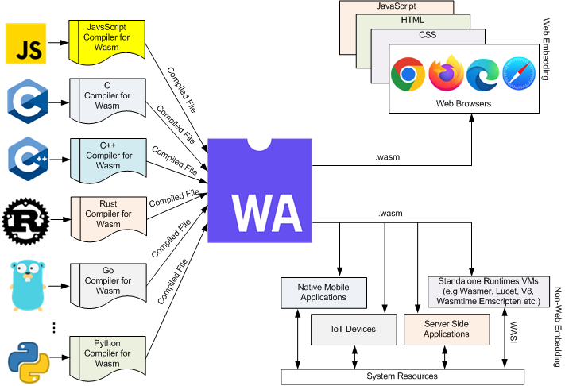

# Xây dựng Front End với Rust

Hi mọi người lại là mình tung-lee đây. Ta đã quá quen thuộc với việc code front end bằng JavaScript nhưng mọi người có bao giờ tự hỏi liệu mình có thể code front end với Rust không? Mình vừa không cần phải học thêm ngôn ngữ mới mà vừa có thể trao dồi kỹ năng lập trình với ngôn ngữ Rust. Một mũi tên trúng 2 đích luôn :))) Ok mở màn nhiêu đó đủ rồi mình bắt đầu vào việc luôn đây.

# Kiến thức yêu cầu

- Biết cơ bản về JavaScript, React
- Biết cơ bản về Rust

# WebAssembly

Có một khái niệm mới mà mọi người cần phải hiểu làm sao browser có thể thực thi được code viết bằng ngôn ngữ Rust vì mọi người có thể đã biết browser có V8 Engine để thông dịch (interpreter) và thực thi code JavaScript cho nên chỉ có JavaScript chạy được trên browser

Còn Rust là ngôn ngữ cần phải biên dịch sang mã máy (bytecode) để có thể thực thi được và bytecode được build ra thực thi được ở platform build ra nó (cố định)

Ví dụ khi ta biên dịch mã nguồn Rust ở hệ điều hành Windows và dựa vào kiến trúc CPU thì ta chỉ có thể thực thi được bytecode ở hệ điều hành Windows nếu đem folder build đó qua MacOS chạy thì sẽ bị lỗi

Ngoài ra, V8 Engine có hỗ trợ thực thi web assembly - là khái niệm mới mà mình cần tìm hiểu.



WebAssembly (viết tắt wasm) là low-level bytecode cho web

Các lợi thế của WebAssembly

- Native level performance (code Rust chạy trên native hiệu năng ra sao thì chạy trên web y chang vậy)
- Đưa nhiều ngôn ngữ lập trình vào web platform (các ngôn ngữ hiện tại có thể biên dich ra wasm thì có C, C++, **Rust**,…)
- Nhanh, an toàn,… hơn JavaScript

`.wat` giống như assembly language `.asm` nhưng mà mình không cần viết bằng ngôn ngữ này mà viết bằng Rust, C++ rồi chỉnh compilation target để build ra .wasm luôn

`.wasm`  như mã máy có thể chạy trên tất cả các trình duyệt

WebAssembly không thể thay thế JavaScript mà tương tác qua lại với JavaScript

Ví dụ: Figma

- UI: sử dụng React
- Chức năng: sử dụng C++ cho hiệu năng cao

Khi thiết lập build setting cho game trong Unity thì nó build ra web assembly

## Minh họa

Có một trang web hỗ trợ compile code sang WebAssembly nhưng chỉ hỗ trợ ngôn ngữ C++. Mình chỉ minh họa cho mọi người xem khi compile sang wasm thì nó sẽ như thế nào nhưng có vẻ như trang web không còn hoạt động nữa, mình chờ compile khá lâu rồi nhưng chưa có kết quả :))) Mọi người có thể thử ở web này xem được không nhé [mbebenita.github.io/WasmExplorer/](https://mbebenita.github.io/WasmExplorer/)


Còn phần kế tiếp mình sẽ minh họa trên ngôn ngữ Rust

## Thiết lập build target cho Rust

Để có thể build ra wasm mọi người cần phải tải

```bash
rustup target add wasm32-unknown-unknown
```

Sau đó mọi người có thể kiểm tra xem đã tải được chưa thông qua lệnh sau

```bash
rustup show
```


Bây giờ mình sẽ thử build ra 2 target và so sánh xem chúng có khác gì nhau không?

Target mặc định trên máy mình là `x86_64-unknown-linux-gnu` nên mình chỉ cần chạy lệnh

```bash
cargo build
```

File binary của mình là file `rust_test` 


Để có thể xem file binary này mọi người có thể truy cập [Online binary file viewer (iamkate.com)](https://iamkate.com/code/binary-file-viewer/)


Xong rồi mình sẽ build với target là wasm, mọi người nhập lệnh sau

```bash
cargo build --target wasm32-unknown-unknown
```


Sau khi build xong mọi người có thể truy cập trang web trên để đọc xem file .wasm có những gì (nó cũng chỉ là bytecode)


Mọi người có thể thấy kích thước của file `wasm` nhẹ hơn kích thước bytecode khi build với target native có thể là do target wasm đã tối ưu để cho file wasm nhẹ hơn để tải nhanh hơn trên web. 

Bây giờ mình sẽ tiến hành tạo các function đơn giản rồi build ra wasm

```rust
fn main() {}

#[no_mangle]
pub extern "C" fn add(num1: u64, num2: u64) -> u64 {
    num1 + num2
}

#[no_mangle]
pub extern "C" fn mul(num1: u64, num2: u64) -> u64 {
    num1 * num2
}

```

Để khi build ra wasm mà ta có thể truy cập đến những function này thì mọi người cần phải thêm

- #[no_mangle]
- pub extern "C"

Tạm thời mọi người cứ làm theo như vậy nhé mình cũng chưa hiểu rõ về 2 thằng này lắm

Sau đó mọi người buid với target wasm

```rust
cargo build --target wasm32-unknown-unknown
```

Sau đó mọi người thêm crate `wasmprinter` 

```rust
cargo add wasmprinter
```

Thư viện này sẽ parse từ `wasm` sang `wat` là mã assembly mà con người có thể đọc được 

```rust
let wat = wasmprinter::print_file(
        "/home/asus/Workspace/rust/rust-test/target/wasm32-unknown-unknown/debug/rust-test.wasm",
    )
    .unwrap();
    File::create("rust-test.wat")
        .unwrap()
        .write_all(wat.as_bytes())
        .unwrap();
```

Sau đó mọi người chạy chương trình

```rust
cargo run
```

Mọi người sẽ thấy có 1 file `.wat` sẽ được tạo ra và file đó có nội dung như sau


Mọi người nhấn tổ hợp phím `Ctrl + F` và nhập từ muốn tìm kiếm là `func $` + tên function để tìm kiếm các function mình đã định nghĩa

Sau đó mình sẽ tạo 1 project front end để thử chạy wasm. Mình sẽ tạo dự án React Typescript bằng vite

Sau khi tạo xong mọi người copy file wasm đã build vào thư mục public


Sau đó mọi người mở file `App.tsx` và thêm đoạn code sau

```jsx
async function loadWebAssembly(fileName: string) {
    const resp: Response = await fetch(fileName);
    const buffer: ArrayBuffer = await resp.arrayBuffer();
    const webAssembly = await WebAssembly.instantiate(buffer);
    console.log(webAssembly);
    return webAssembly.instance;
  }

  useEffect(() => {
    async function run() {
      const instance = await loadWebAssembly("/rust-test.wasm");
      console.log(instance);
      console.log(instance.exports.add);
      const add = instance.exports.add as (a: bigint, b: bigint) => bigint;
      const mul = instance.exports.mul as (a: bigint, b: bigint) => bigint;
      const sum = add(BigInt(40), BigInt(2));
      const diff = mul(BigInt(40), BigInt(2));
      console.log(sum);
      console.log(diff);
    }
    run();
  }, []);
```

Mình có thể `console.log(webAssembly)` để xem có những thông tin nào


field module là array lưu các thông tin memory, các function, global liên quan. Theo như mình nghĩ nó sẽ lưu các thông tin liên quan đến memory được sử dụng ở trên browser vì lúc này wasm sẽ sử dụng memory của browser (cái này mình không chắc lắm) 


Để có thể sử dụng được các hàm trong wasm thì ta phải truy cập field instance


Như mọi người có thể thấy được các function mình đã định nghĩa và các thông tin bộ nhớ, global liên quan, bây giờ mình thử in object function ra để xem nó có khác gì function mình đã định nghĩa không nhé


Ok sau khi mình in ra thì nó là native code (chứ không phải là code JavaScript)


Nhấn vào thì nó sẽ điều hướng sang phần source và ta đang xem nội dung của .wat 

Một điều mình thấy không hay đó là mình không biết được rõ type để có thể truyền vào.

## Blockchain

Một số hệ blockchain ví dụ như cosmos thì khi build cũng target đến wasm và gọi là wasm smart contract. Này mình giới thiệu qua thôi chứ mình cũng chưa tìm hiểu kỹ.

# Rust FE

Ok thế là xong về một khái niệm quan trọng để ta có thể giải thích được vì sao Rust có thể code được Front end. Giờ thì triển đến phần chính luôn nhé bên Rust có một framework hỗ trợ code Front End với lượt Star hiện tại là `30.1k` , cộng đồng cũng khá to lớn

## Giới thiệu về Yew

- Component Based giống React (hook, props, function component,…)
- Tương tác được với JavaScript

## Thiết lập vscode

### User Snippet

Mọi người vào link sau [https://yew.rs/docs/getting-started/editor-setup#vs-code](https://yew.rs/docs/getting-started/editor-setup#vs-code) lấy đoạn user snippet để có template tạo component. Sau đó vào Manage > User Snippet > rust.json > paste nội dung đã lấy vào > save 

 


### Extension

Extension [https://yew.rs/docs/getting-started/editor-setup#vs-code-1](https://yew.rs/docs/getting-started/editor-setup#vs-code-1) hỗ trợ syntax highlight,…

## Trunk

Trunk is a WASM web application bundler for Rust. (giống vite, webpack)

Trunk sẽ tự động build lại app mỗi khi source code thay đổi

Ngoài ra mọi người có thể config trunk thông qua file sau

`Trunk.toml`

```toml
[serve]
# The address to serve on LAN.
address = "127.0.0.1"
# The address to serve on WAN.
# address = "0.0.0.0"
# The port to serve on.
port = 8000
```

## Hướng dẫn

Mọi người tạo dự án mới

```jsx
cargo new fe-app
cd fe-app
```

Sau đó mọi người thêm crate `yew` vào `Cargo.toml` 

```jsx
[dependencies]
yew = { git = "https://github.com/yewstack/yew/", features = ["csr"] }
```

feature `csr` là client side rendering 

Sau đó mọi người mở file `main.rs` và thay đổi như sau

```rust
use yew::prelude::*;

#[function_component(App)]
fn app() -> Html {
    html! {
        <>
            <h1>{"Hello World"}</h1>
        </>
    }
}

fn main() {
    yew::Renderer::<App>::new().render();
}
```

Khai báo macro `function_component` bất cứ khi nào mọi người muốn tạo component và function_component phải trả về `Html` 

macro `html!` giống như định nghĩa JSX bên React (fragment, cách truyền dữ liệu để render,…)

macro khai báo tên component

Sau đó mọi người tạo file `index.html` 

```html
<html>
    <head>
        <meta charset="utf-8" />
        <title>Chat App</title>
    </head>
    <body></body>
</html>
```

Thay vì ở React ta phải tìm element nào là root thì yew mặc định root sẽ là body tag khi function `yew::Renderer::<App>::new().render()` được gọi trong hàm `main`  

Sau đó sử dụng trunk để build ra wasm và chạy app

```rust
trunk serve
```

### Quản lý code

Mình muốn có 1 folder riêng để quản lý các component (giống như cách tổ chức thường sử dụng cho React). 

Mọi người tạo folder `components` ở thư mục gốc. Sau đó mọi người tạo file `app.rs`.


Mọi người copy các đoạn code liên quan đến App component ở file `main.rs` sang file `app.rs` nhé

### UI + Logic

Mình định làm giao diện để có thể sử dụng cái realtime chat-app server mình đã làm ở series trước nhưng mình có tìm hiểu qua thì Rust chưa có nhiều crate hỗ trợ socket client nên mình không hứa chắc sẽ làm được đâu nhé :))))

Đầu tiên mình sẽ tạo `Title` component và props cho nó

`src/components/title.rs`

```rust
use yew::prelude::*;

#[derive(Properties, PartialEq)]
pub struct TitleProps {
    pub content: Option<String>,
}

#[function_component(Title)]
pub fn title(props: &TitleProps) -> Html {
    let TitleProps { content } = props;
    html! {
        <>
            if let Some(content) = content {
                <h1>{content}</h1>
            } else {
                <h1>{"Front End App"}</h1>
            }
        </>
    }
}

```

Để định nghĩa struct props cho component cần thêm macro `Properties` và `PartialEq` 

Ở đây mình có sử dụng kĩ thuật `conditional rendering` 

Sau đó mình tạo component `Message` 

Mọi người tạo thêm file [types.rs](http://types.rs) ở thư mục gốc để lưu các type dữ liệu cần hiển thị

`src/components/message.rs`

```rust
#[derive(Debug, PartialEq, Clone)]
pub struct Message {
    pub content: String,
    pub author: String,
}
```

2 macro cần phải có là `PartialEq` và `Clone`. 

```rust
use yew::{function_component, html, Html, Properties};

use crate::types::Message as MessageType;

#[derive(PartialEq, Properties)]
pub struct MessageProps {
    pub msg: MessageType,
}

#[function_component(Message)]
pub fn message(props: &MessageProps) -> Html {
    let MessageProps { msg } = props;
    let MessageType { content, author } = msg;
    html! {
        <div>
            <h3>{content}</h3>
            <p>{author}</p>
        </div>
    }
}
```

Sau đó mọi người tạo component `BoxChat` 

`src/components/box_chat.rs`

```rust
use yew::{function_component, html, Html, Properties};

use crate::components::message::Message;
use crate::types::Message as MessageType;

#[derive(PartialEq, Properties)]
pub struct BoxChatProps {
    pub messages: Vec<MessageType>,
}

#[function_component]
pub fn BoxChat(props: &BoxChatProps) -> Html {
    let BoxChatProps { messages } = props;
    html! {
        <div>
            {messages.iter().map(|msg| {
                html! {
                    <Message msg={msg.clone()} />
                }
            }).collect::<Html>()}
        </div>
    }
}
```

Ở đây mình sử dụng kĩ thuật để render 1 list (array, vec,…) 

Sau đó mình thêm các component vào `app.rs`

```rust
use yew::prelude::*;

use crate::components::box_chat::BoxChat;
use crate::components::title::Title;
use crate::types::Message;

#[function_component(App)]
pub fn app() -> Html {
    let messages = vec![
        Message {
            content: "Hello Ben!".to_string(),
            author: "Alex".to_string(),
        },
        Message {
            content: "Hi Alex!".to_string(),
            author: "Ben".to_string(),
        },
    ];
    html! {
          <>
                <Title content={Some("FE App")}/>
                <BoxChat messages={messages} />
          </>
    }
}
```

**Lưu ý:**

Component `Title`  không hiểu sao mặc dù mình để field trong props là option nhưng không truyền vào thì nó sẽ báo lỗi. Mọi người ai biết thì giải đáp giúp mình nhé.

Sau đó thì mình sẽ cần thêm input element để lấy được input chat của người dùng và mình cần quan tâm đến các thứ sau đây

- event
    
    Mọi người có thể tìm kiếm các event ứng với Event type trong Rust ở link sau [https://yew.rs/docs/concepts/html/events#available-events](https://yew.rs/docs/concepts/html/events#available-events)
    
    Và lưu ý event nào trong html phải ứng với Event type trong Rust nếu không sẽ báo lỗi và lỗi nó báo không rõ ràng lắm
    
- callback có thể sử dụng để child component đưa data lên parent component

Đầu tiên mọi người cứ tạo component trước đi

`src/components/input.rs`

```rust
use std::ops::Deref;

use gloo::console::log;
use log::info;
use wasm_bindgen::JsCast;
use web_sys::HtmlInputElement;
use yew::prelude::*;

#[derive(PartialEq, Properties)]
pub struct InputProps {
    pub r#type: String,
}

#[function_component(Input)]
pub fn input(props: &InputProps) -> Html {
    let on_change = Callback::from(|evt: Event| {
        let target = evt.target().unwrap(); // We can safely unwrap here because we know that the target is an input element
        info!("{:?}", target.clone());
        log!(target.clone());
        let input = target.unchecked_into::<HtmlInputElement>();
        info!("{:?}", input.value());
        log!(input.value());
    });

    let InputProps { r#type } = props;
    let r#type = r#type.deref().to_string();

    html! {
        <input type={r#type} onchange={on_change} />
    }
}
```

Không như JavaScript khi ta lấy được `target` của event là lấy được `html element` và từ đó lấy được value thì với Rust phải có type cụ thể để biết element đó là gì. 

Mình cần có thêm crate `wasm-bindgen` để có `JsCast` và crate `web-sys` để có thể tương tác với web api trên browser

### Debug

Sử dụng println sẽ không in ra terminal đâu vì wasm chạy trên browser cho nên phải sử dụng các crate sau để debug

`gloo` , `wasm-logger` , `log`

- gloo: giống console log
- wasm-logger + log: giống như debug trên terminal nhưng thay vì in trên terminal thì sẽ in trên console của browser

Theo mình thấy nên kết hợp cả 2 để debug cho thuận tiện 


Phía trên là sử dụng `log` với `wasm-logger` 

Phía dưới là sử dụng `gloo`

Sau đó tạo component button luôn

`src/components/button.rs`

```rust
use yew::prelude::*;

#[derive(PartialEq, Properties)]
pub struct ButtonProps {
    pub label: String,
}

#[function_component]
pub fn Button(props: &ButtonProps) -> Html {
    let ButtonProps { label } = props;
    html! {
        <button>{label}</button>
    }
}
```

### State

Có 2 cách xử lý:

1. pass callback dưới dạng props
2. pass use state dưới dạng props (giống React)

Trong trường hợp này mình sẽ tiếp cận theo cách thứ 2 nhé

```rust
use std::ops::Deref;

use wasm_bindgen::JsCast;
use web_sys::HtmlInputElement;
use yew::prelude::*;

#[derive(PartialEq, Properties)]
pub struct InputProps {
    pub r#type: String,
    pub state: UseStateHandle<String>,
}

#[function_component(Input)]
pub fn input(props: &InputProps) -> Html {
    let state = props.state.clone();

    let on_change = Callback::from(move |evt: Event| {
        let target = evt.target().unwrap(); // We can safely unwrap here because we know that the target is an input element
        let input = target.unchecked_into::<HtmlInputElement>();
        state.set(input.value());
    });

    let r#type = props.r#type.deref().to_string();

    html! {
        <input type={r#type} onchange={on_change} />
    }
}
```

Ở đây có vài chỗ mình vẫn đang tìm hiểu này là bên ngôn ngữ Rust thôi

- keyword move
- Khi mình sử dụng props trong callback thì bị borrowed value và cần phải clone ra

Mọi người ai biết thì mình cùng thảo luận nhé

`app.rs`

```rust
use std::ops::Deref;

use gloo::console::log;
use yew::prelude::*;

use crate::components::box_chat::BoxChat;
use crate::components::button::Button;
use crate::components::input::Input;
use crate::components::title::Title;
use crate::types::Message;

#[function_component(App)]
pub fn app() -> Html {
    let message = use_state(|| "".to_string());

    let messages = vec![
        Message {
            content: "Hello Ben!".to_string(),
            author: "Alex".to_string(),
        },
        Message {
            content: "Hi Alex!".to_string(),
            author: "Ben".to_string(),
        },
    ];
    html! {
          <>
                <Title content={Some("FE App")}/>
                <BoxChat messages={messages} />
                <Input r#type="text" state={message.clone()} />
                <Button label="Send"/>
                <p>{message.deref().to_string()}</p>
          </>
    }
}
```

Cơ chế hoạt động state của yew mình cảm thấy hơi đặc biệt mặc dù clone ra 1 state khác nhưng nó vẫn có mối liên hệ với nhau

## Tổng kết

Trong bài viết này ta đã:

- Hiểu về WebAssembly
- Biết cách sử dụng event, callback, state bên Yew

## Github

[https://github.com/Learning-Tech-Workspace/learn-rust-fe](https://github.com/Learning-Tech-Workspace/learn-rust-fe)

Trong bài viết có sai sót gì mọi người cùng thảo luận góp ý nhé.

Cảm ơn mọi người đã đọc.